## 前言

上一篇（[蓝屏工具箱插件上传教程 - SDCOM‘s blog (chgskj.cn)](https://sdcom.cnstlapy.cn/282.html)）我们向大家介绍了蓝屏工具箱插件上传教程，所以这一次，就一次做到底，做一次完整的教程给大家！

## 注意

本软件支持Windows10 11，server系列系统完全不可用，其他系统暂时未测试

## 下载

浏览器输入https://tools.chgskj.cn/或者是[点击这里](https://tools.chgskj.cn/)下载

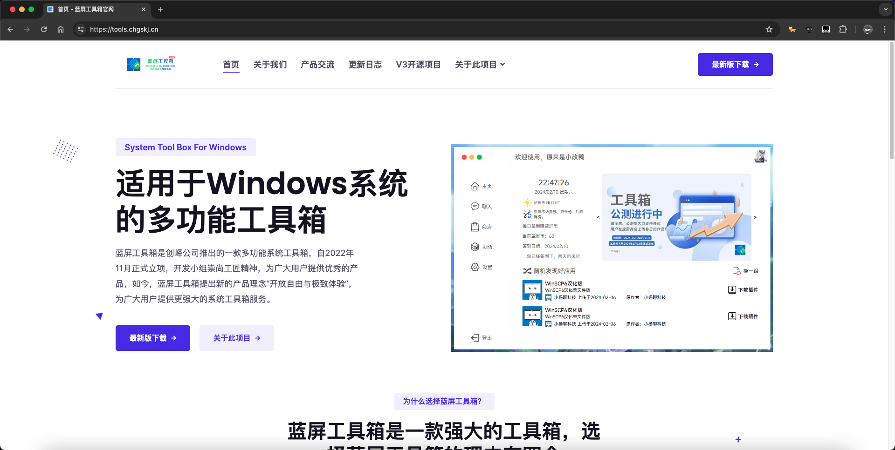

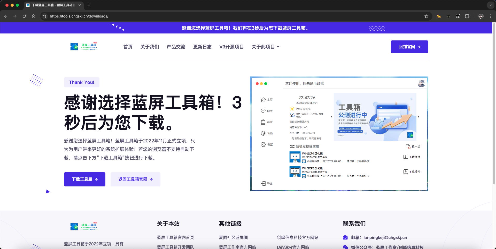

若您的浏览器不支持自动下载，请网站下载页面的“下载工具箱”按钮进行下载或[点击此处](https://s123.chgskj.cn/LanPingBox/4.1.4.5120/LanPingBoxSetup_4.1.4.5120.exe)下载

## 安装

<figure>

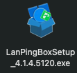

<figcaption>

安装包图片

</figcaption>

</figure>

<figure>

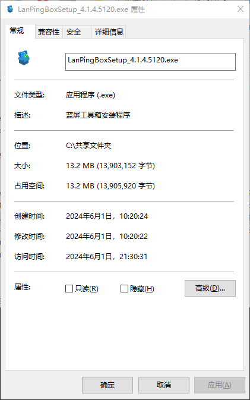

<figcaption>

属性

</figcaption>

</figure>

双击安装包打开安装程序

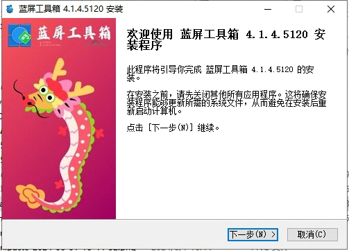

同意用户协议

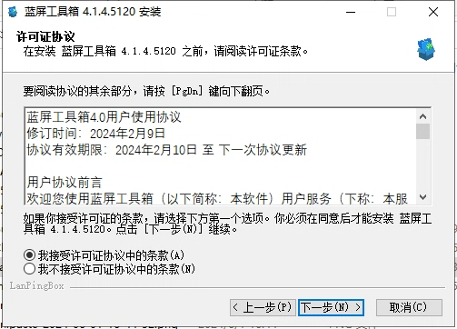

安装完成

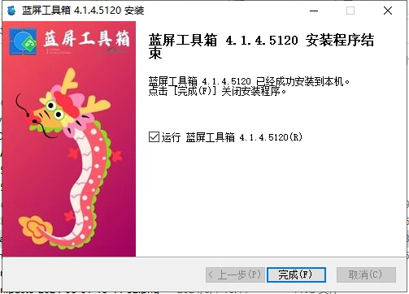

## 蓝屏工具箱4.0&SUI3.0

蓝屏工具箱4.0版本采用新一代SUI——SUI3，优化以往的产品布局，相对之前的产品布局更加现代化，并且界面设计较为科学。

- 全新SUI3.0，更加现代化与更加合理的产品布局

- 引入蓝屏工具箱的新型产品模式——积分制度

- 轮播最近正在进行的活动，快速了解当前活动

### 登录注册

不用说，就是登录功能和注册功能的页面

登录页：

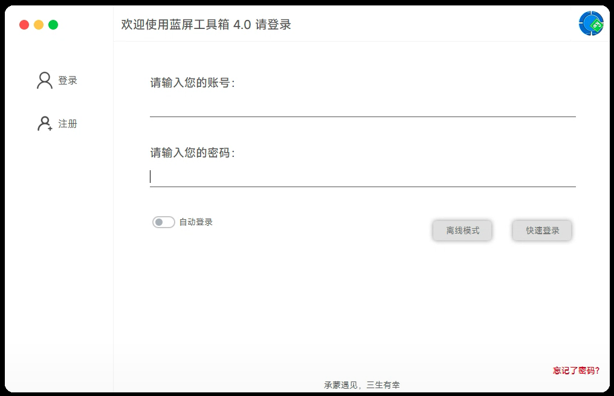

注册页(均为必填项)：

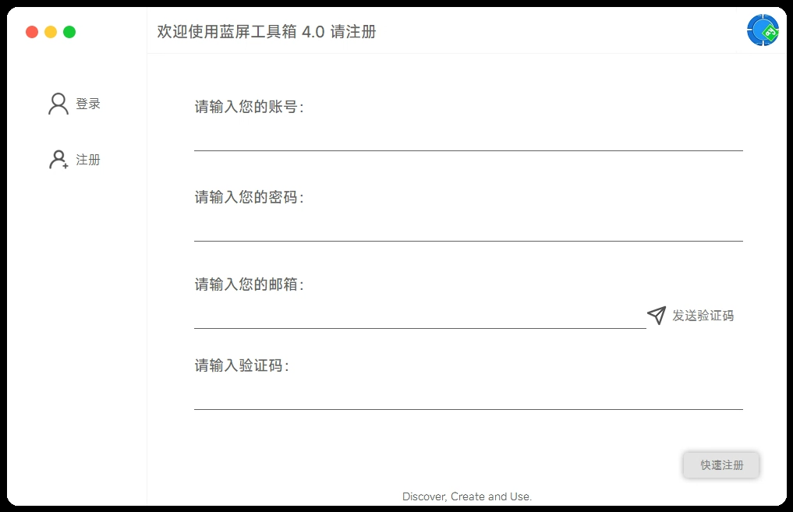

忘记密码页：

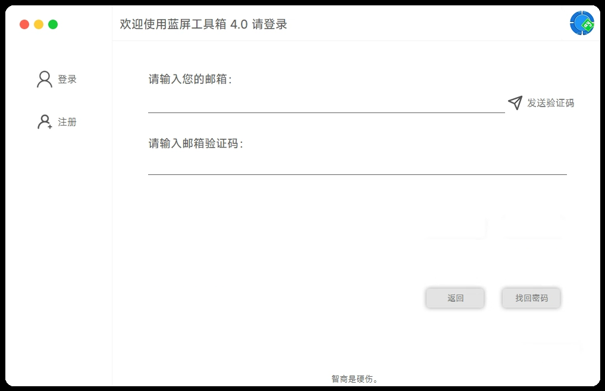

登录加载页面（若使用代理，请记得关闭代理，否则无法进入）

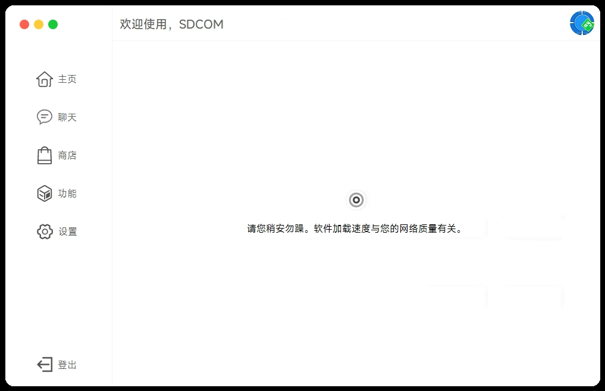

### 蓝屏工具箱4.0主界面

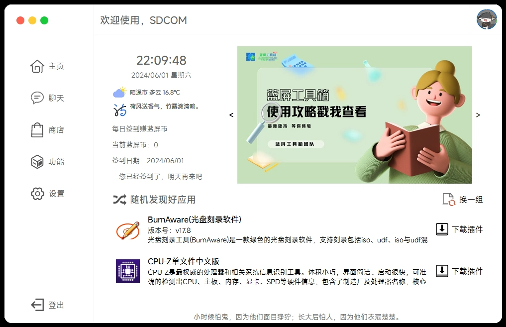

#### 活动区

首页公告双击即可打开公告对应网址

#### 随机发现好应用区

每次进入时都会随机推选两个插件在首页，点击换一组还可以切换另外两个插件

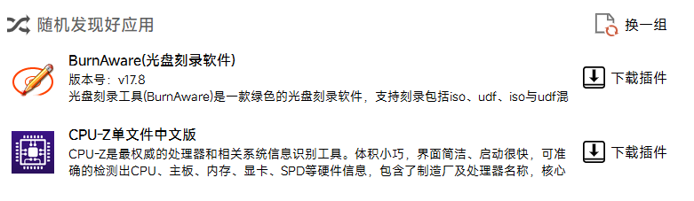

<figure>

<figcaption>

采用真随机的后果

</figcaption>

</figure>

#### 状态区

分别对应着时间、地区天气、蓝屏币

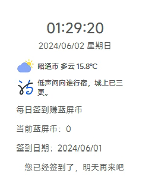

### 蓝屏工具箱4.0聊天室

蓝屏聊天室（蓝聊）作为沟通开发者与用户之间交流的介质在蓝屏工具箱的历史中存在了很久，在4.0版本中，对聊天室的一些配置做了适当修改，增强用户体验。

- 支持发送图片，对发送消息的配置做了些改进

- 支持查看聊天记录，重要消息不错过

- 优化发送方式，使发送消息的体验更加优秀

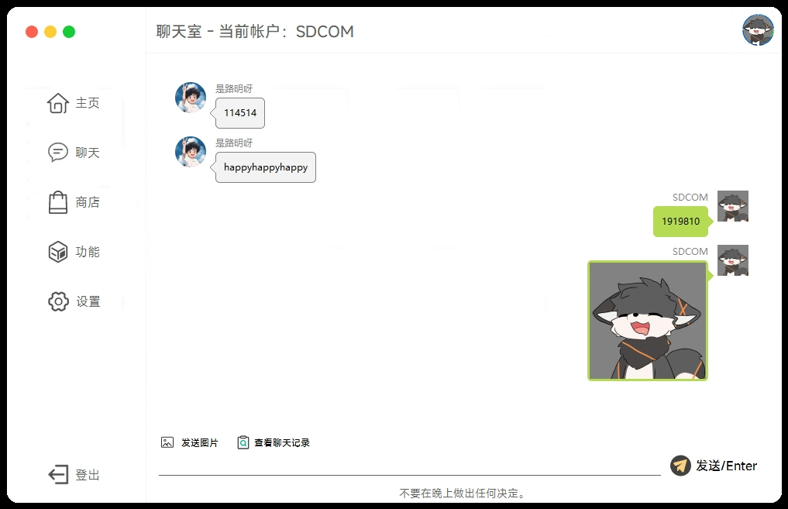

### 蓝屏工作室4.0应用市场

蓝屏工具箱全新应用市场，使软件大小进一步缩小，用户根据自己的需求自己下载或导入插件，不仅优化了软件所占空间，还激发了开发者开发的动力。[操作简单易懂，可快速上手](https://sdcom.cnstlapy.cn/282.html)。

- 全新应用市场，优化了软件的所占空间

- 开放自由，自主开发，强大高效

- 自由了蓝屏工具箱，且丰富了蓝屏工具箱

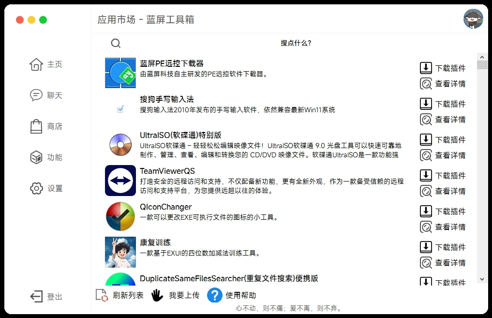

优秀的审核系统，从根本上杜绝了各种违反法律法规的的插件和病毒，拒绝版权纠纷
