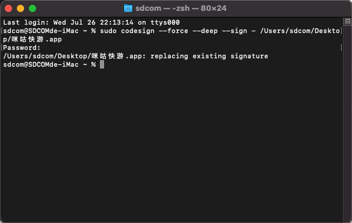

## 前言

在上上次的文章中，我们教大家安装了黑苹果（不会的点[这里](https://sdcom.cnstlapy.cn/index.php/2023/07/13/%e9%bb%91%e8%8b%b9%e6%9e%9c%e5%ae%89%e8%a3%85%e6%95%99%e7%a8%8b/)）。但是在实际体验中，我们会发现，某些软件并不支持旧版本的macOS，就比如这样

因为本人的显卡是NVIDIA GeForce GT 720，所以免驱升级macOS12是不可能的，所以这里我们就需要使用到一些特殊的手段来进行修改已达到运行这个软件的效果

## 准备工作

1. 一个修改工具，[PlistEdit pro](https://www.fatcatsoftware.com/plisteditpro/)(点击就可以下载了)

3. 一个不支持低版本运行的软件

## 快速修改

1.如果你是macOS12以上则直接在官网选择“Download free trial”，并跳过2步骤

2.如果你是macOS12及以下的系统，下滑，点击“Older version downloads”，进入后选择合适的版本

3.下载并解压完成后，把程序拖放放在任意位置，右键程序选择“显示包内容”

4.双击“Contents”，找到“Info.plist”文件

5.右键“Info.plist”文件，选择打开方式，选择“PlistEdit pro”并打开(如果识别不到请到评论区评论)

6.在弹出的窗口点击“install”安装插件

7.在这一堆内容中找到“LSMinimumSystemVersion”

8.将右侧数字值修改为比本机macOS版本低的数值，例如我的macOS版本是11.6.6，这里我修改成11.4

9.点击屏幕上方的“File”，再点击“Save”

10.修改完后保存并关闭

11.但是我们此时还没有办法打开，这是因为签名G了，所以要重新签名

11.1.打开终端，在终端输入这个指令

sudo codesign --force --deep --sign -

11.2.空格，将app拖入终端

11.3.回车，输入开机密码（这里不会显示）

11.4.当出现“/存储地点/软件名.app: replacing existing signature”时，就重新签名好了

12.这样，我们就能够打开不支持低版本macOS的软件了！

## 注意事项

1. 此方法可能导致软件崩溃，并且可能会遇到未知bug，还是建议在新版macOS的App Store下载后在旧版macOS的App Store下载

3. 如果遇到无法打开，就可以在“系统偏好设置”中找到“安全性与隐私”，给软件赋予权限即可；或者通过“[常用小工具](https://sdcom.lanzouy.com/iVvK513kntzc)”软件打开任何来源就可以了。

## 结尾

希望大家能够多多支持正版，还是去用新版的macOS吧！
