## 前言

在我们使用macOS的时候，想要使用一些软件，但是发现只支持Windows，这就十分的令人烦躁，就好比如[原神](https://ys.mihoyo.com)（玩原神玩的）；

不仅仅只是不支持的情况，还有部分体验被阉割的软件，例如macOS的[网易云音乐](https://music.163.com)的一起听被阉割了，而Windows版本是有的；

所以我们就要选择合适的软件来运行Windows软件

常见的在macOS运行Windows软件的方式有两种：

1. 基于wine的[crossove](https://www.codeweavers.com/crossover)[r](https://www.bing.com/search?q=crossover)

3. 虚拟机：[VirtualBox](https://www.bing.com/search?q=VirtualBox)、[VM](https://www.bing.com/search?q=VMWare+Fusion)[Ware Fusion](https://www.vmware.com/content/vmware/vmware-published-sites/cn/products/fusion/fusion-evaluation.html)和[Parallel Desktop](https://www.bing.com/search?q=Parallel%20Desktop)等

使用crossover相对于安装虚拟机来说要方便一些，也更快捷一些，所以这次的文章就以crossover运行蓝屏工具箱来作为例子

## 正式开始

### 安装crossover

首先我们下载一个破解版的crossover（正版¥158永久授权，有能力的可以去支持）

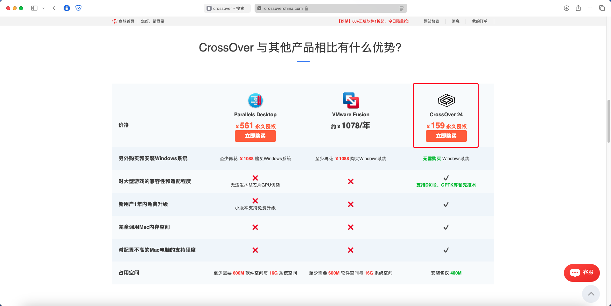

破解版crossover下载地址：[地址1](https://59-47-225-57.pd1.123pan.cn:30443/download-cdn.123pan.cn/123-203/6051a908/1813455574-0/6051a908eff065dbe1a9d2c3518318cb/c-m41?v=5&t=1719207509&s=171920750921954b34ec652e6f5320394da51aeb65&r=CCM75L&bzc=1&bzs=1815196616&filename=CrossOver+24.0.3+Crked+-+Digit77.com.dmg&x-mf-biz-cid=a97cec9b-fd97-47bc-82f4-f7dd2c511e75-584000&auto_redirect=0&ndcp=1&cache_type=1&xmfcid=034d317e-9405-4970-925e-cae7a6640889-1-abf611255) [地址2](https://www.digit77.com/apps/crossover.html)

打开Dmg镜像密码为digit77.com，之后点击同意

把软件本体拖入`Applications(应用程序)`文件夹

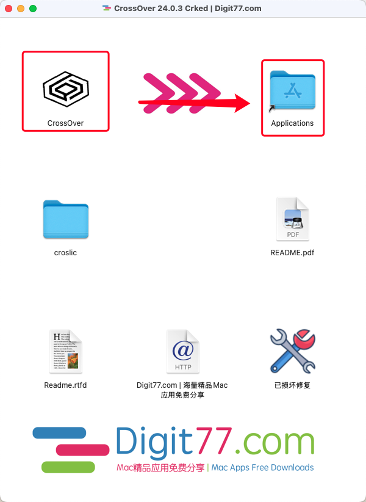

拷贝完了别着急打开，将镜像中的`croslic`文件夹放在桌面上

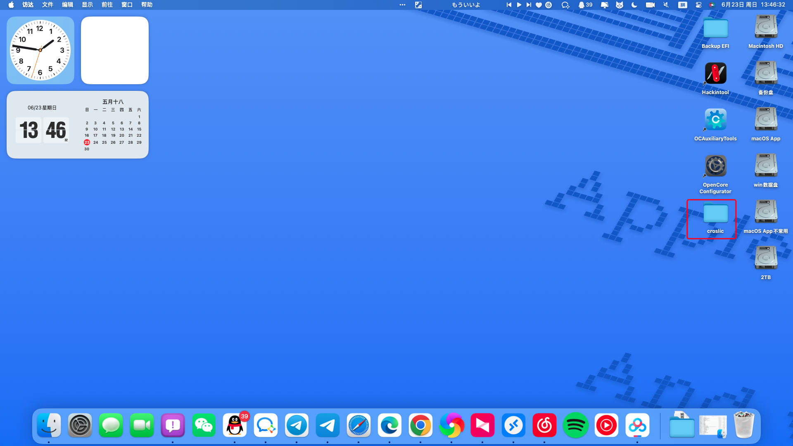

打开拷贝出来的文件夹，运行`license.tool`文件

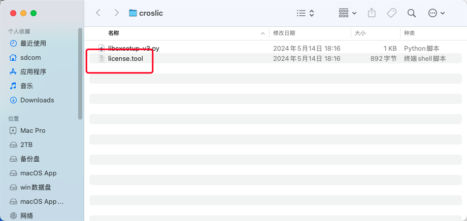

输入你的电脑密码，并回车（这个阶段电脑不会显示密码）

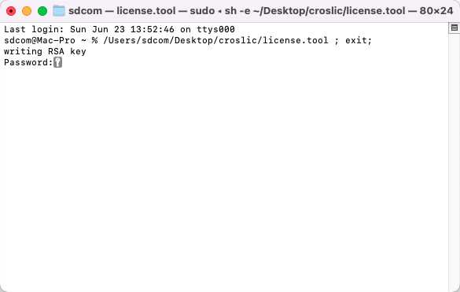

提示`[进程已完成]`时，就可以关闭终端，打开crossover

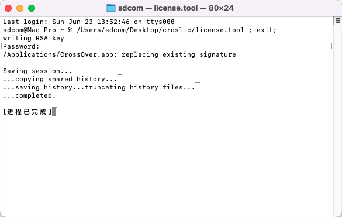

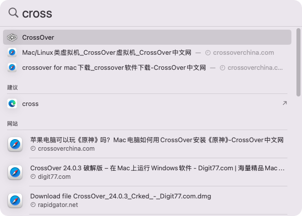

进入后，是这样的一个页面

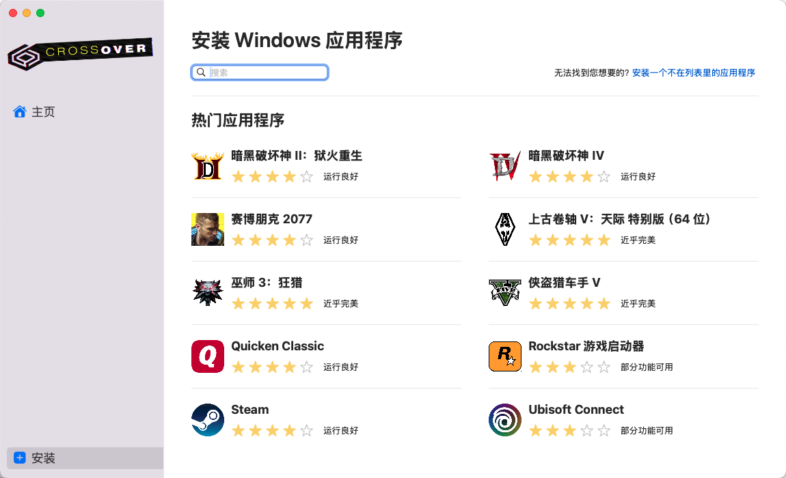

进入设置页，将检查crossover更新关闭；

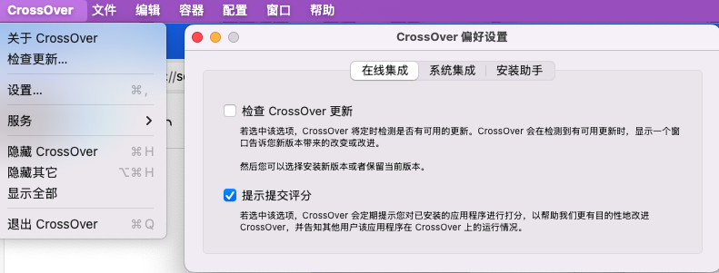

安装助手页的所有项目关闭

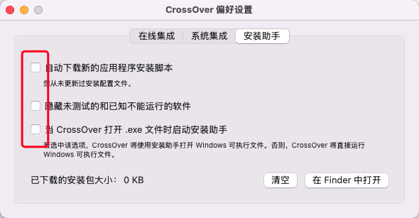

选择顶栏的容器，选择新建容器

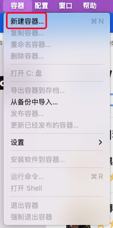

选择`Windows 10 64位`，名称填你自己喜爱的名称，等待创建完成

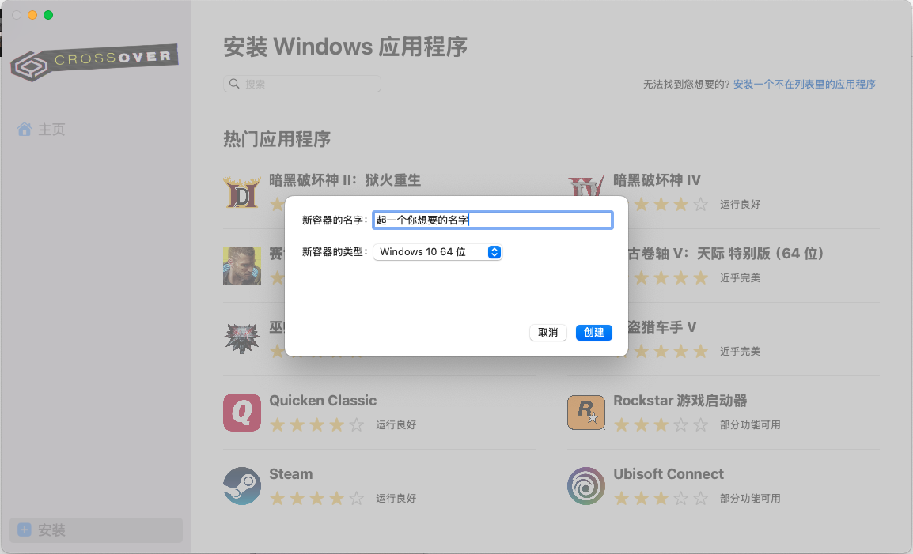

### 安装蓝屏工具箱

进入[蓝屏工具箱官网](https://tools.chgskj.cn/)，下载蓝屏工具箱

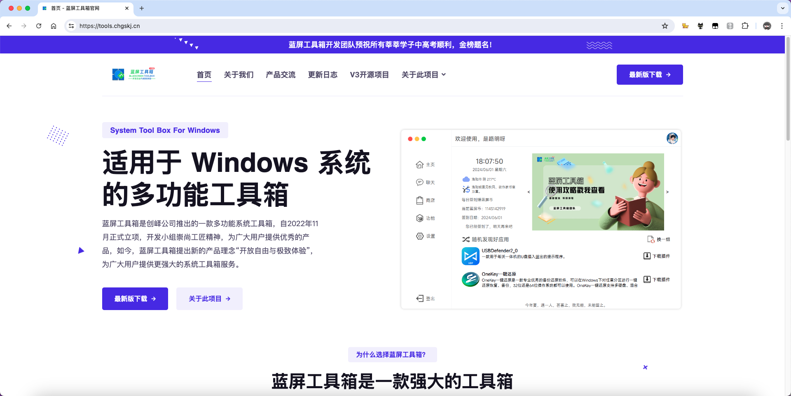

把蓝屏工具箱的安装包放在一个好找的地方，这里我就放在下载处

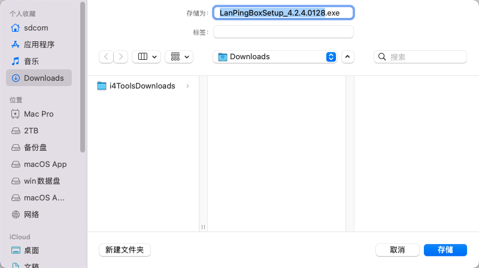

下载完成后，选择安装应用程序到容器

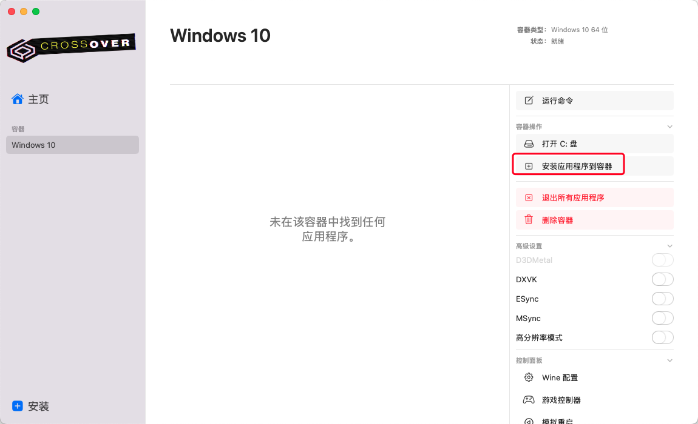

选择`安装一个不在列表里的应用程序`

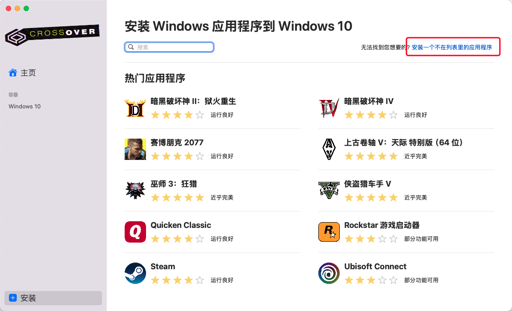

选择安装包

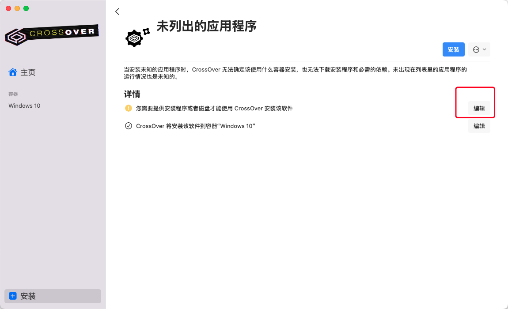

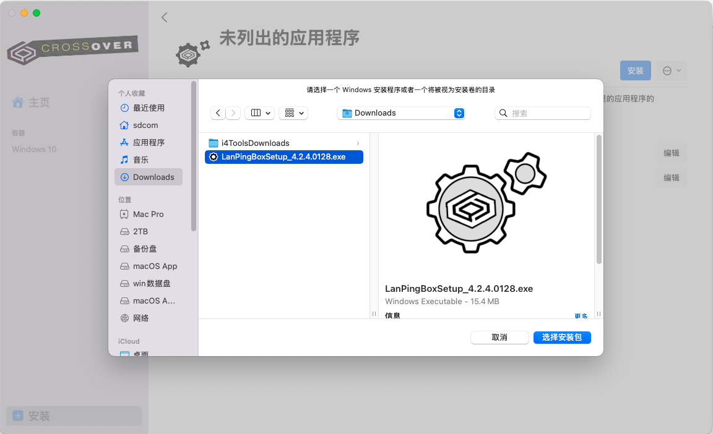

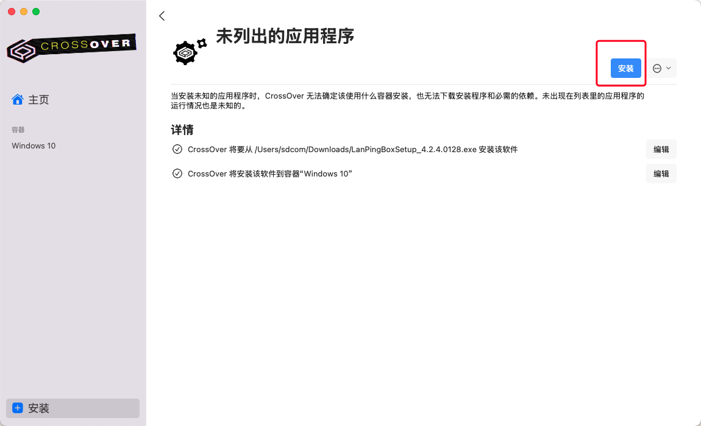

进入安装程序按照安装流程安装，记住不要选择立即运行，会出现中文显示问题

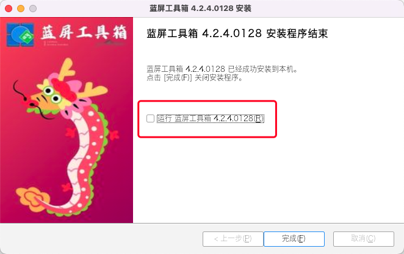

打开蓝屏工具箱，登录你的账号就ok了

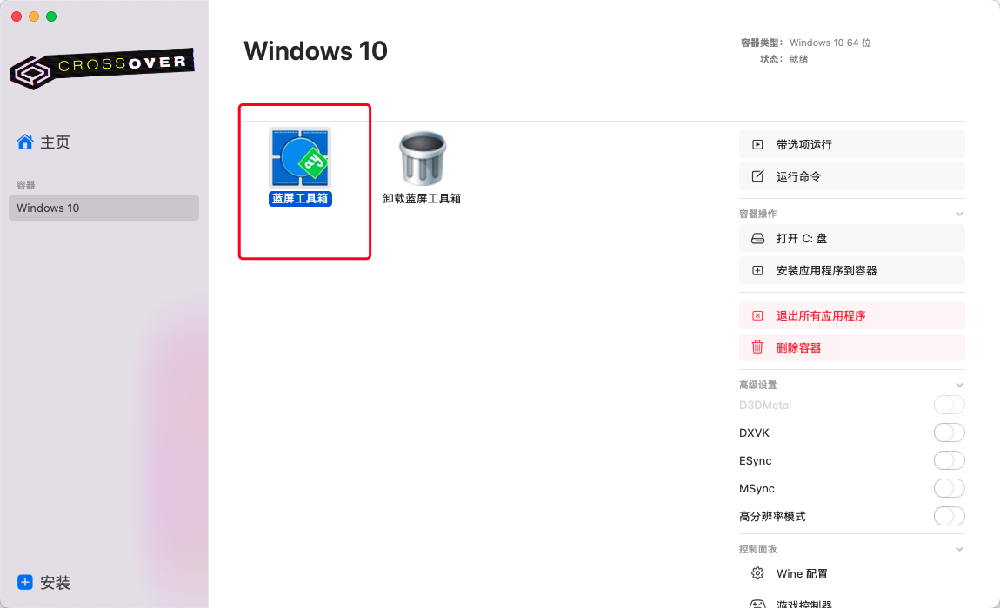

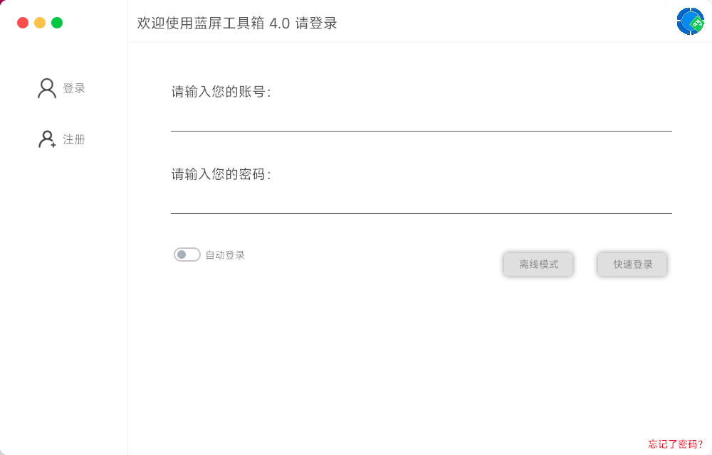

## 结尾

如果你成功运行了Windows软件，那么恭喜你

