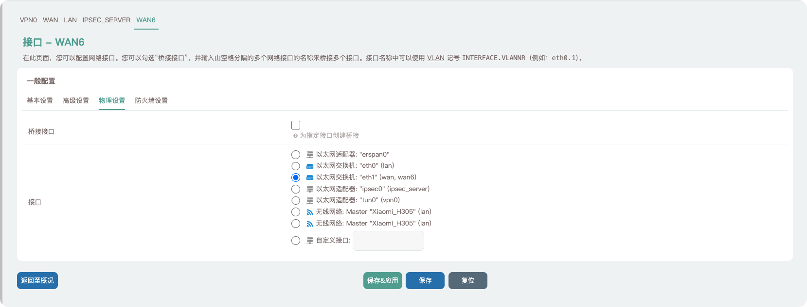
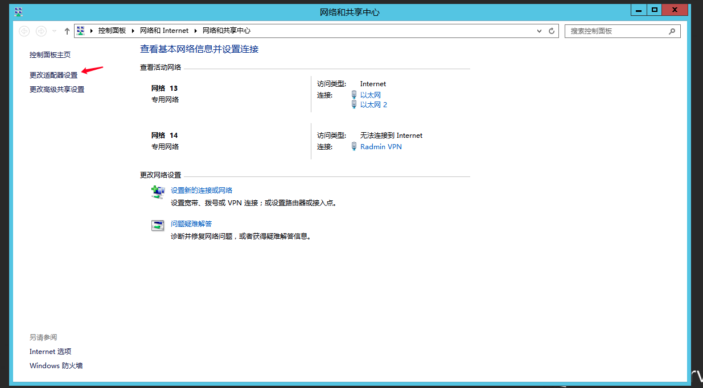
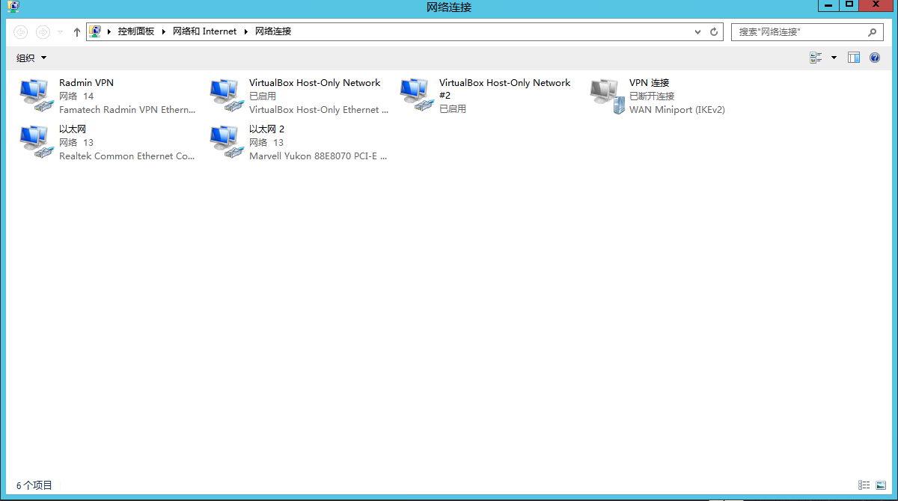
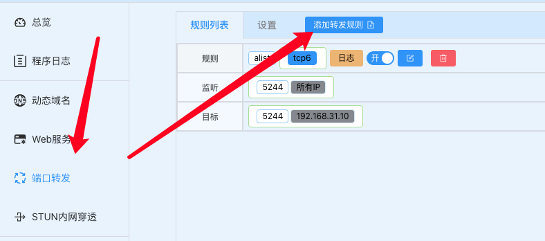
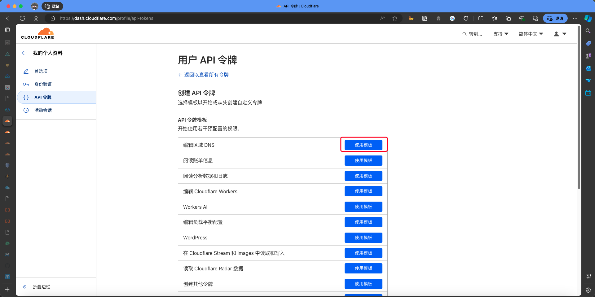
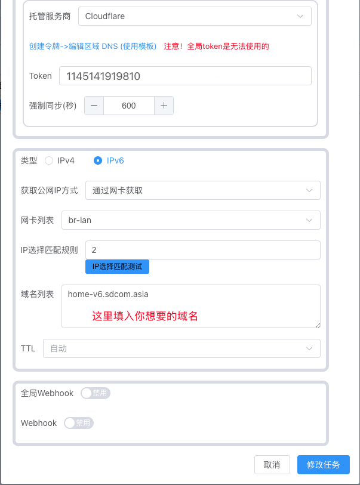

## 前言

如今在IPv4地址资源严重不足的情况下，大家都处于大内网环境中，而且也不是人人都能申请公网IP，这便限制了我们很多乐趣

好在，现在IPv6越来越普及，各大运营商都默认开通了IPv6，并且只要能分配到IPv6的设备，就是一个公网IP，既然是公网IP就可以通过外网直接访问，这样一来咱们必须得好好利用起来，不然开启了IPv6的意义何在？

具体来说，就是人没在家，可以通过外面的网络，直接访问到家中Alist、路由、服务器等等设备，远程控制，岂不美哉

## 前置条件

很多小伙伴会出现：开启了IPv6，但还是无法在外网通过IPv6地址访问家中设备的情况，这就是家里某个网关防火墙，或者端口转发的问题了。因此，布置并设置好家里的各个网关是很关键的

下面，梳理一下几种常见家庭网络布局，并说说如何才能达到目的：

1.光猫拨号---硬路由做主路由：

这种一般是由光猫拨号，家中路由器直接DCHP上网

2.光猫拨号---OpenWrt做主路由---硬路由做子路由；

前面两种情况都不推荐，因为这样，光猫其实也充当了路由器的作用，外部数据会先进入光猫再由光猫发给路由器。想要访问家中设备，需要光猫的防火墙放行IPv6入站请求，先不说很多光猫都不支持，就算能支持，到了主路由以后也需要主路由防火墙能放行IPv6入站请求，而且这也设计的网络效果还不如去掉OpenWrt路由设备来的好

3.光猫桥接---硬路由做主路由---OpenWrt做子路由或旁路由

这种情况需要确保硬路由支持IPv6以及自带防火墙能放行IPv6入站请求或者硬路由支持IPv6端口转发，否则依然无法通过公网IPv6访问到家中设备，现在市面上中高端路由器一般都默认关闭了IPv6防火墙，还是很容易就能实现咱的目的

4.光猫桥接---OpenWrt做主路由---硬路由做中继只负责家中WIFI

我家就是这样布置的，只需要配置OpenWrt就能达到目的

综上所述，想实现通过IPv6访问家中设备，先决条件为以下几点：

1. 光猫桥接，大部分光猫可以通过拨打宽带运营商电话，让客服远程修改桥接模式(或者闲鱼上面去买超级管理员密码，我是这样的)

3. OpenWrt作为主路由的情况下，需要将硬路由改为中继模式，并且关闭DHCP，不然会出现主路由下设备无法访问子路由下设备的情况。

本文将介绍OpenWrt作为主路由时，如何开启IPv6，并在开启后，通过两种方法实现外网访问家中设备

## 实践设备

主路由器：Xiaomi AX3000T

副路由：TP-LINK ac1200（所有设备均接入主路由）

## 开启IPv6

**请按照接下来截图的设置来进行设置**

**省流：除了上网方式(e. g:PPPoE、DCHP)其他一律默认**

### 接口 --- LAN

### 接口 --- WAN6

### 接口 --- WAN

> **当OpenWrt为子路由或旁路由时，不用配置WAN口，可以跳过本步骤**
> 
> 
> 
> 

### DHCP设置

通过以上配置，OpenWrt中已成功开启了IPv6，可以在网络---接口中查看：

上图所指可见我们的获取到的公网IPv6地址

我一般使用LAN接口获取到的地址来用

> - 移动ipv6是2409开头的。
> 
> - 电信ipv6是240e开头的
> 
> - 联通ipv6是2408开头的。

## 电脑开启IPv6

### Windows

右键任务栏网络图标，选择网络和共享中心

选择更改网络适配器设置

选择你的上网网卡

点击属性

勾选

禁用网卡后重新启动网卡

重启后，我们也在Windows拿到了IPv6地址

### macOS

打开系统设置，选择网络

选择你的上网网卡，点击详细信息

选择TCP/IP，选择自动，点击完成

这样，我们也在macOS拿到了IPv6地址

## 通过IPv6地址访问内部网络

下面我们尝试使用IPv6地址直接访问OpenWrt试试看，在浏览器中打开：

> 注意，需要用中括号“\[\]”包裹住你的IPv6地址

但是，各位请试试，在手机上关闭WIFI，使用移动网络，访问你的IPv6地址，极有可能是**无法访问**状态，不必担心，下面介绍两种解决方案

### **配置防火墙（不推荐）**

我的OpenWrt固件并没有打包防火墙功能，所以这路不做演示

虽然通过配置防火墙的接受入站、以及接受转发就可以可实现通过公网IPv6访问了，但是这样设置的话会接收全部入站请求和转发，将你所有能获取到IPv6的设备全部暴露在公网，很不安全，所以不推荐

### **通过软件Lucky配置端口转发**

这款软件支持IPv6&4端口转发、IPv6&4 动态域名、自动配置防火墙规则、网络唤醒等服务，常用的工具可以在一个软件中实现，还是比较不错的。

> 当然，还可以通过ssh链接OpenWrt使用命令行编辑防火墙规则，这个对普通人不太友好

#### 安装**Lucky**

##### 下载（自行选择自己设备的架构）（镜像v2.10.5）

[GitHub](https://github.com/gdy666/luci-app-lucky/releases/) [GitCode](https://cnb.cool/SDCOM_File/img/-/git/raw/master/pictures/2024/08/2/21_19_8_lucky.zip) [腾讯云COS](https://sdcom.cnstlapy.cn/wp-content/uploads/PicGo/lucky.zip) [蓝奏云](https://sdcom.lanzouo.com/b0swyqned)(密码1234) [下载站](http://alist.sdcom.cnstlapy.cn/lanzou/lucky)(限时返场，仅限IPv6，为本期文章的成果)

##### 安装

进入文件传输页，上传你下载的ipk文件

找到上传的文件，选择安装

进入服务---Lucky，启动它，然后点击管理员后台登录信息的链接，如果像我这样没有显示的话那么就直接使用路由器IP+16601端口

账号密码默认为666，建议进入设置页面后尽快修改账号密码

#### 配置Lucky

点击左侧端口转发，再点击添加转发规则

按照图中配置来

设置好以后，我们使用OpenWrt后台---网络---端口---LAN口中的公网IPv6地址来访问测试

e. g:使用[http://\[2409:8a6c:2050:ba60::1\]:5244](http://[2409:8a6c:2050:ba60::1]:5244)就可以进入我搭建的alist，

#### 效果

我的山东朋友的测试

到这里，就完成了开启Ipv6并配置端口转发，成功从外网访问到家中设备。

可是还有问题，**公网IPv6地址每隔一段时间或者重启路由器就会发生变化**。一旦改变，我们又身在外面时，原来保存的地址也就无法访问了

这时就需要使用ddns工具，实时的将我们的IPv6地址解析到域名。 然后我们直接访问域名就好

## DDNS绑定IPv6

首先需要有一个自己的域名，免费的域名挺多，但是会有一些限制，不介意的小伙伴的可以自己去申请，只要能够使用cloudflare等DNS商即可

或者在阿里云、腾讯云、新网、万网这些平台购买一个域名，价格也不贵，最便宜的也才几块钱一年，如果域名有备案的话，默认网页端口80，443随便使用；**如果没有备案，请不要使用上述两个端口！**

下面以托管在cloudflare的域名为例：

在刚刚的Lucky后台进入动态域名---添加任务

修改托管商为cloudflare，点击下面的链接进入cloudflare API令牌配置页面

选择创建令牌

选择编辑区域 DNS > 使用模版

随着下图的权限修改

修改完成后应该是这样的

然后下一步，然后创建令牌

复制令牌（一定要保存好，以后不会显示这段令牌）

粘贴到Token区域

在下面，把获取公网地址方式修改为通过网卡获取，网卡修改为br-lan

把鼠标指针放在网卡列表的br-lan上一般会有两个IPv6地址

查看哪个是你的公网IPv6地址，记住前面的序号

在旁边的IP选择匹配规则的框里面填入你公网IPv6的序号，我这里是2，所以填2。再点击下面的IP选择匹配测试来测试到底是不是公网IPv6地址

然后添加域名

然后添加任务

设置完成后，通过域名访问试试：

可以看到访问成功了

如果提示

那么一般是路由器默认禁止80端口的访问，想要开启的话，需要使用ssh登录OpenWrt，然后 `vi /etc/config/uhttpd` 文件，将`option rfc1918_filter 1`改为`option rfc1918_filter 0`，保存后即可。但是不推荐开启，比较建议使用别的端口转发

## 结尾

IPv6越来越普及，nat大内网、frp的存在性正在逐渐的降低；但是，许多设备依旧是只能使用IPv4的设备，例如我的副路由TP-LINK ac1200就是不支持IPv6的，所以，IPv6的普及，只是降低一些跨地域连接的局限性，并不能够完全替代掉IPv4以及一些在nat大内网时代的产物。

虽然IPv6普及了，但是风险也提高了，nat技术让你的网络没有办法收到攻击，但是IPv6的点对点的特性，非常的容易收到攻击，所以是有利有弊

**最后温馨提示：操作有风险，玩机需谨慎，教程仅供参考，操作具体情况请以个人设备为准！**
