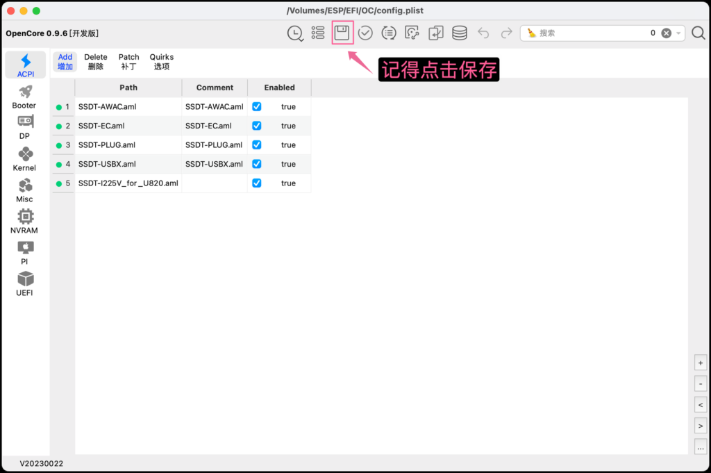
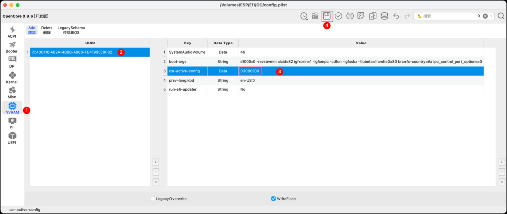
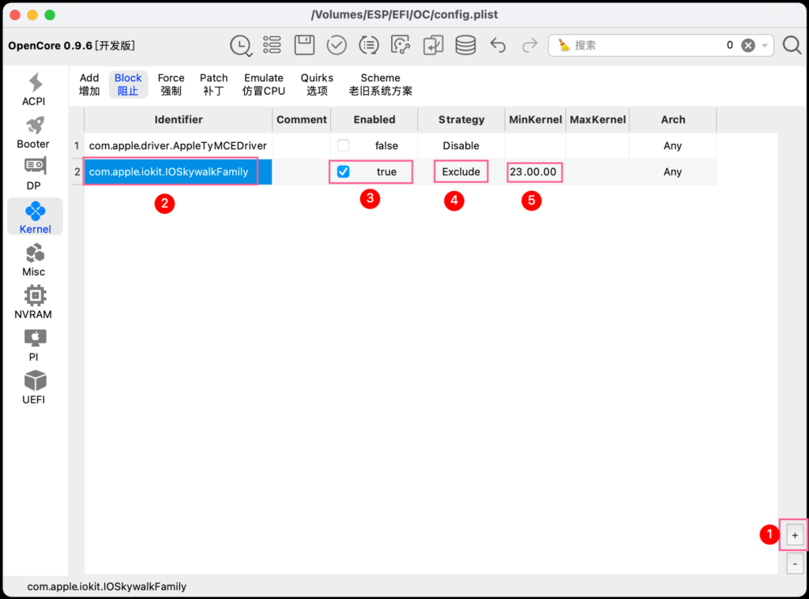
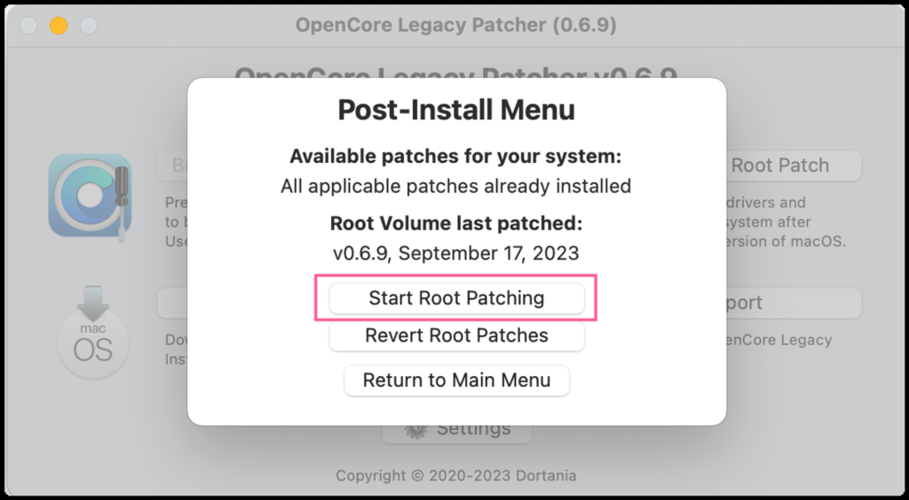

## 更新 OC 和 Kexts

1.使⽤ OCAT 挂载 EFI 分区

2.使⽤ OCAT 打开 config.plist

3.获取最新开发版 OC 和 Kexts

**注意要点：**

- **推荐全程科学上⽹ ，github的更新源会好点，否则1️⃣请选择其他更新源；**

检查Kexts更新 的时候全选， 更新Kexts 的时候只选择有更新的，这样能⽐较快更新完  
毕；

更新完，记得点击保存按钮；

## 调整内核参数和驱动(oclp)注⼊顺序

1.将系统完整性保护设为 0x0803

NVRAM>Add>7C436110-AB2A-4BBB-A880-FE41995C9F82>csr-active-config | Data type |  
03080000

2.将 csr-active-config 添加到 Delete  
NVRAM>Delete>7C436110-AB2A-4BBB-A880-FE41995C9F82>csr-active-config

3.将 AMFI 禁⽤，并解决关闭 SIP 引起的问题  
NVRAM>Add>7C436110-AB2A-4BBB-A880-FE41995C9F82>boot-args | String | amfi=0x80  
ipc\_control\_port\_options=0

- boot-args 后加 amfi=0x80 ，即可禁⽤AMFI

- boot-args 后加 ipc\_control\_port\_options=0 ，解决抖⾳APP没法打开等由安全设置  
    被关闭引起的问题

**⚠️关闭系统完整性保护功能SIP后，依赖SIP的部分APP会闪退或不能正常打开**

## 存在问题纠正

增加amfi=0x80参数后，存在注⼊后的PD虚拟机以及VMWare Fusion⽆法使⽤的问题。

解决办法

**A.boot-args 后去掉 amfi=0x80 参数**

**B .注⼊ [AMFIPass.kext](https://github.com/dortania/OpenCore-Legacy-Patcher/blob/main/payloads/Kexts/Acidanthera/AMFIPass-v1.4.0-RELEASE.zip) ， MinKernel 填 23.00.00 ，以确保补丁仅适⽤于Sonoma**

<figure>

<figcaption>

复制AMFIPass.kext到Kexts⽬录下

</figcaption>

</figure>

<figure>

<figcaption>

按+号，从窗⼝中选取AMFIPass.kext，MinKernel填23.0.0

</figcaption>

</figure>

**C.增加启动参数 -amfipassbeta ，使AMIFIPass⽣效**

4.将 SecureBootModel 设置为 Disabled

5.将 com.apple.iokit.IOSkywalkFamily 的加载阻⽌

- 将 Identifier 设置为 com.apple.iokit.IOSkywalkFamily

- 将 Enabled 前⾯的勾打上

- 将 Strategy 设置为 Exclude

- 将 MinKernel 设置为 23.00.00 ，以确保补丁仅适⽤于Sonoma

**⚠️警告：请正确设置好此项，否则有开机卡内核的⻛险！！！**

6.将 Kext 按顺序注⼊

**A.获取 IOSkywalk.kext 和 IO80211FamilyLegacy.kext**

下载、解压缩并复制以下kext到 /EFI/OC/Kexts ⽬录下

[IOSkywalkFamily.kext.zip](https://github.com/dortania/OpenCore-Legacy-Patcher/blob/e21efa975c0cf228cb36e81a974bc6b4c27c7807/payloads/Kexts/Wifi/IOSkywalkFamily-v1.0.0.zip)

[IO80211FamilyLegacy.kext.zip](https://github.com/dortania/OpenCore-Legacy-Patcher/blob/e21efa975c0cf228cb36e81a974bc6b4c27c7807/payloads/Kexts/Wifi/IO80211FamilyLegacy-v1.0.0.zip)

**B.调整注⼊顺序**

AirPortBrcmNIC.kext 是包含在 IO80211FamilyLegacy.kext ⾥的⼦驱动，后者复制进  
Kext⽬录后，OCAT⾥即可看到前者，必须保证这个也被注⼊。

按照以下顺序进⾏放置，将 MinKernel 设置为 23.00.00 ，以确保补丁仅适⽤于  
Sonoma：

**⚠️警告：加载顺序不能颠倒，否则有开机卡内核的⻛险！！！**

## 重启计算机

完成以上设置后，重启计算机。

## 安装和使⽤ OCLP

1.下载  
\[官方GitHub\][OpenCore Legacy Patcher(OCLP)](https://github.com/dortania/OpenCore-Legacy-Patcher/releases) 最新Sonoma版

\[备选\]OpenCore-Patcher.v0.6.9.Sonoma-development.nightly-20230917.zip  
◦ [⼩⻜机⽹盘](https://www.feijix.com/s/r6UCMpZY)(不限速，推荐)  
◦ [城通⽹盘](https://url42.ctfile.com/f/40294042-938689398-633802?p=6634)  
◦ 此为2023年9⽉17⽇版本，不保证持续更新

2.安装

OpenCore Legacy Patcher > Post-Install Root Patch > Start Root Patching > 完成

3.享受  
重启后，WiFi、蓝⽛、隔空投送、通⽤控制、隔空播放都恢复正常。

## 系统更新后

需要重新操作⼀遍步骤4，推荐下载最新⽇期的OCLP。

## 参考内容

### Preliminary support for macOS Sonoma #1077

[Preliminary support for macOS Sonoma by khronokernel · Pull Request #1077 · dortania/OpenCore-Legacy-Patcher (github.com)](https://github.com/dortania/OpenCore-Legacy-Patcher/pull/1077)

### Dortania的Hackintosh笔记 | 为Sonoma驱动博通⽆线⽹卡的详细步骤

[Dortania的Hackintosh笔记 | 为Sonoma驱动博通无线网卡的详细步骤-远景论坛-微软极客社区 (pcbeta.com)](https://bbs.pcbeta.com/viewthread-1975545-1-1.html)

### 解决使⽤OCLP后百度云盘、天翼云盘等软件打不开的问题

如果打开APP有问题，则需要注⼊个AMFIPass.kext驱动。

[解决使用OCLP后百度云盘、天翼云盘等软件打不开的问题-远景论坛-微软极客社区 (pcbeta.com)](https://bbs.pcbeta.com/viewthread-1975320-1-2.html)
