## 注意事项

本文**_前半部分_**来自[夏雨社区（原创峄博客）](https://blog.chgskj.cn/272.html)修改而来，后半部分为自写

本文的**_后半部分_**也仅仅适用于WordPress博客系统的[Argon](https://github.com/solstice23/argon-theme)主题

感谢同事的帮忙部署，感谢广然笔记的站长发的这么好的源码！

如果需要查看这个源码是来自哪的可以点击右侧：[侧边栏IP签名档——样式修改 - 广然笔记 (rsecc.cn)](https://blog.chgskj.cn/?golink=aHR0cHM6Ly93d3cucnNlY2MuY24vNzk5Lmh0bWw=)

这个东西，真的是——《 太 好 用 啦～》

## 前言

大家好，欢迎来到SDCOM's blog

之前[美化了alist](https://sdcom.cnstlapy.cn/?p=126)，也要美化下blog对吧

然后，我的同事问我要不要搞IP签名档，我就想着，给Ta搞搞

所以，我的侧边栏就有了这个

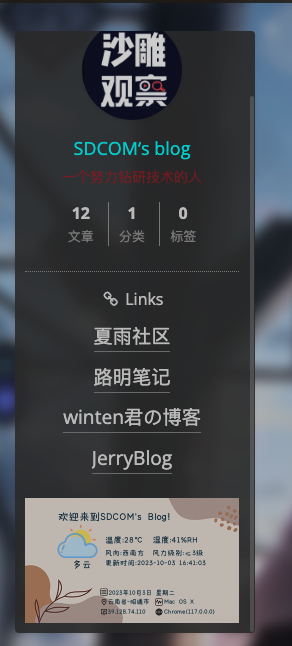

在这里有一个特别的地方，那就是下面的IP签名档。这个组件我们可以应用到我们网站上起到一个装饰的作用。

那么，我们如何生成这样的一个图片呢？

## 前期准备

### 源码下载

[ipsignature.zip](https://dz.sdcom.asia/lanzou/ipsignature.zip)

### 部署文件及申请API

在目录下创建一个文件夹，文件夹就叫ipsignature，之后把压缩包解压到ipsignature这个目录里后删除压缩包。

这里源码要改两个地方，就是把api换成自己的，如下面代码。

```
/*高德地图开发者key*/
private $key = '请填写高德地图开发者api';
/*腾讯地图开发者key*/
private $txkey = '请填写腾讯地图开发者api';
```

代码见index.php的第4-7行，代码中，第5行和第7行需要换成我们自己的API（其实就是应用的key）。

申请链接：[高德开放平台](https://blog.chgskj.cn/?golink=aHR0cHM6Ly9sYnMuYW1hcC5jb20v)、[腾讯地图开放平台](https://blog.chgskj.cn/?golink=aHR0cHM6Ly9sYnMucXEuY29tLw==)[](https://blog.chgskj.cn/?golink=aHR0cHM6Ly9sYnMuYW1hcC5jb20v)

高德地图开放平台注册完账号认证后创建一个应用，名称随意，分类选其他，之后添加key。名称随意，分类选web服务，如下图。（直接使用夏雨社区的图片）

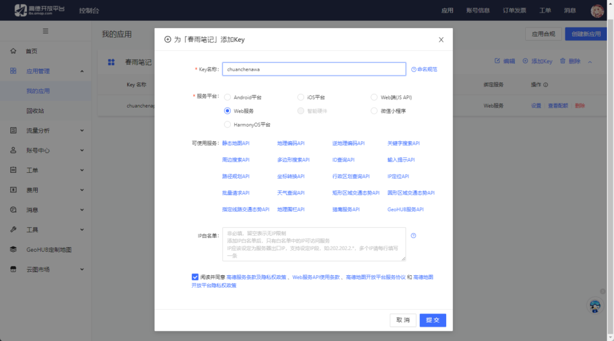

同意相关协议后点提交会有一个key，复制后替换index.php第5行单引号里的内容。

腾讯地图选择控制台，创建个应用，名称随意，分类选其他，之后添加key。名称随意，之后都不用选，**选WebServiceAPI后不填白名单，然后同意条款后提交后继续**，也会得到一个key，复制后替换index.php第7行里单引号内的内容。

保存后访问你的网址/ipsignature，就比如我的就是[https://serverp.chgskj.cn/Ipsignarture/SDCOM/](https://serverp.chgskj.cn/Ipsignarture/SDCOM/)，如下图。

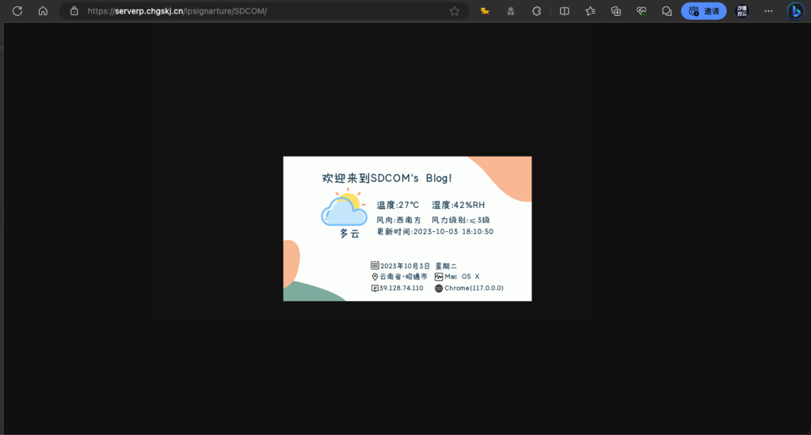

## 部署到边栏

进入后台，找到外观

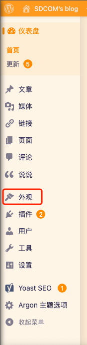

选择小工具

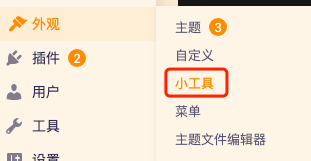

选择左侧栏小工具

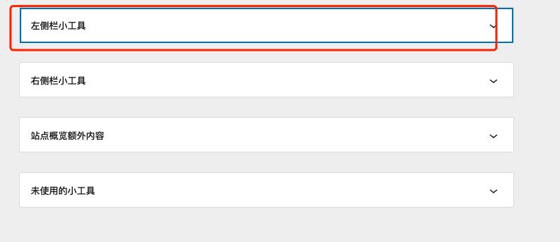

点击+号

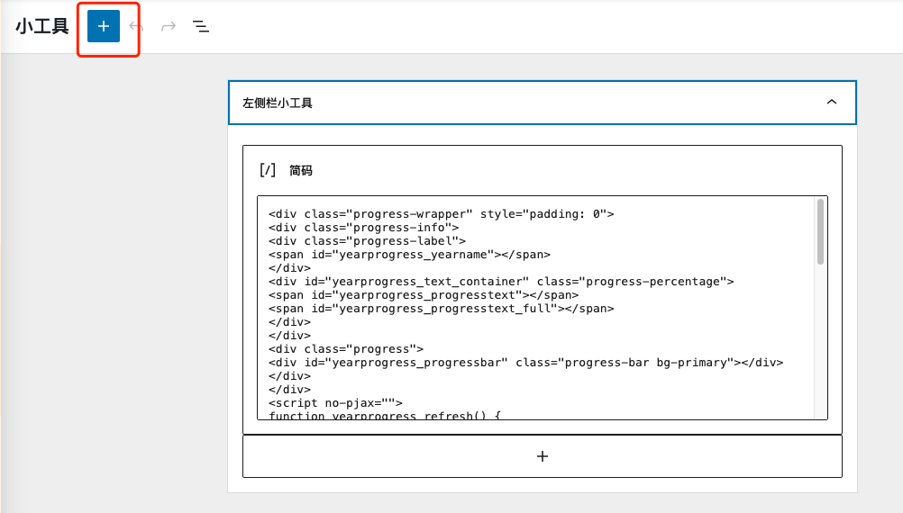

搜索自定义html

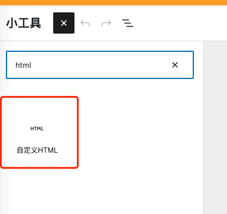

将这一段演示代码粘贴进入

```
<!DOCTYPE html>
<html lang="zh-hans">
    <head>
        <title>Demo</title>
    </head>
    <body>
        
    </body>
</html>

```

粘贴完成后，你就能在概览旁边的功能里面看到了

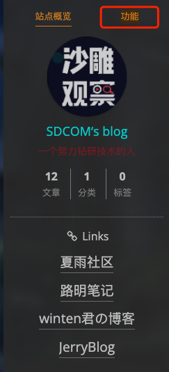

但是我的可不是这样，我的就在站点概览中

所以，你只需要把代码粘贴到站点概览额外内容就可以了

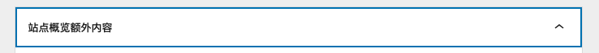

这样显示出来的就是在站点概览中的了

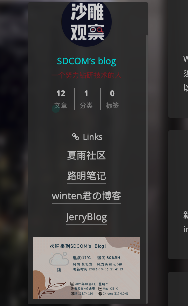

## 结尾

总之，这玩意还是十分甚至九分的好用，还是很不错的，肥肠好用

下个文章再见，拜拜！
