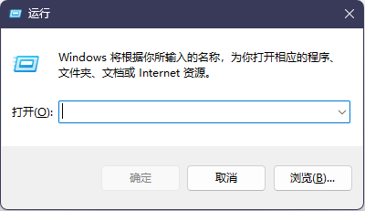
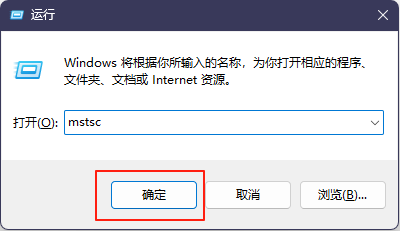
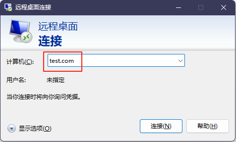
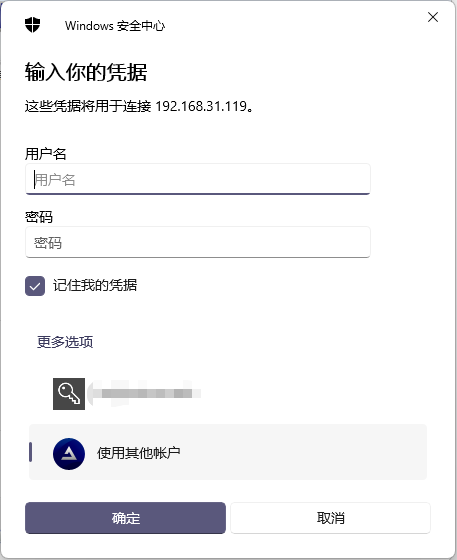

## 安卓

安卓连接软件点击[此处](https://www.123684.com/s/bCwtVv-au7eh)下载

## iOS

iOS苹果用户请在**美区**App Store搜索微软远程桌面，配置方法和安卓差不多

## macOS

macOS用户点击[此处](https://www.123684.com/s/bCwtVv-Ju7eh)下载安装软件

- 下载完成后，双击打开安装包

- 将程序本体拖入至应用程序文件夹

- 拖入完成后，在启动台找到它并打开它

- 进入主页面，点击 Add PC 或者是 +

- 在 Add PC页面，在PC name一栏中，输入链接地址。

- 在 Add PC页面，在User account点击小三角，选择Add User Account.

- 在下一个页面中，输入你的用户名和密码

完成后点击Add就添加完成了

## Windows

如果你使用的是Windows11/10，并且为非精简系统，可以在微软应用商城搜索微软远程桌面下载UWP版本，配置简单

接下来演示的是系统内置的方法

- 按住键盘上的win+r，调出运行框

- 输入mstsc ，点击确定

- 进入软件主页面输入连接信息

- 点击下方的连接

- 在弹出的密码框输入自己的账户密码方可连接

## 常见错误

### 0x204

服务器未开机，或者网络原因，导致无法连接

属于服务器问题

### 0x407

目前未了解错误原因

### 0x207

服务器:用户创建配置出错，导致密码过期

用户:账号密码输入错误

属于服务器、用户问题

### 0x104

完全无法找到这个服务器，大概率服务器寄了，和0x204是同类型

属于服务器问题
