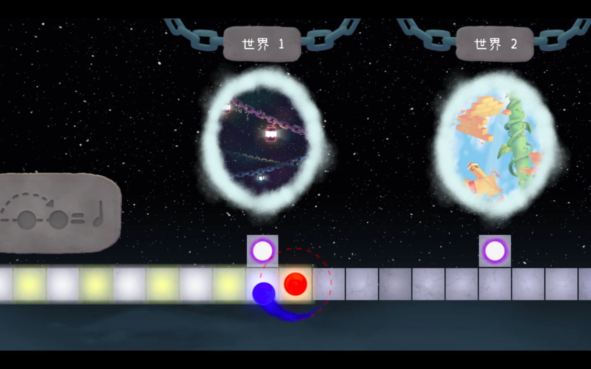
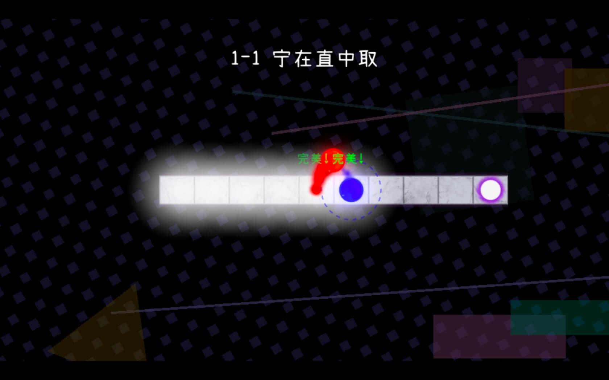
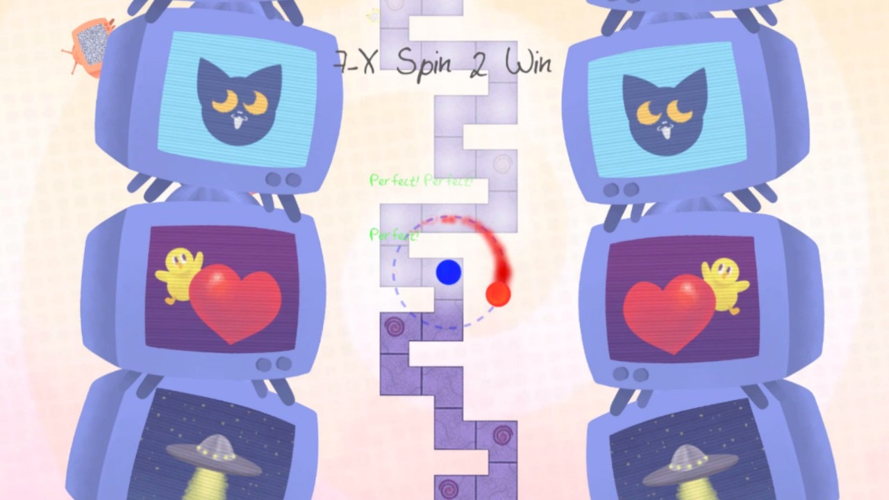

### 游戏介绍

《冰与火之舞》——高难度单键节奏游戏。

只需一个按键，控制盘旋飞舞的双星，踏着摇曳的舞步，在一条跟随音乐节奏变化的蜿蜒道路上不断前进，探索音乐的宇宙。

将节奏巧妙地使用可视的形式呈现出来。  
这将是一次充满挑战的音乐之旅，保持平稳的心态，跟随内心的律动，这并不是一款依赖快速反应的游戏，你需要通过反复练习来学习不同的音乐模式。  
你将与各种困难不期而遇，而每一次突破，都会带来无与伦比的成就感。

- **探索音乐宇宙：**每一片星系都对应着一种截然不同的音乐类型，跟随纠缠的双星游荡在充满美妙音乐的宇宙当中。

- **可预判的机制：** 你能通过识别前方的道路来预判即将迎来的音轨节奏。游戏并不依赖快速反应，注意聆听音乐，反复练习，掌控应对不同类型的节奏的操作。

- **未来的音乐关卡将免费更新：**我们会在游戏发售后陆续更新更多新关卡，已经购买过游戏的玩家无须为这些更新再次付费。但游戏的售价可能会随着更新有所提升。

- **支持延时校准：**既可以随时通过按键手动校准，也可以使用我们的自动校准功能。作为音乐创作者，我们非常了解音轨不同步会极大地影响音乐游戏的体验，因此，这款游戏采用了极其严格的时间判定方式。

- **飙速模式：**完成一周目后，你将迎来速度与挑战不断飙升的全新模式。专为那些永不满足的玩家准备。

- **只需一个按键:** 你可以使用键盘上的大多数按键控制这个游戏。理论上，可以支持多种外设。你甚至可以使用太鼓来游玩本游戏。

## 下载地址

[冰与火之物2.5.0-steam.dmg | SDCOMの下载站](https://dz.sdcom.asia/OneDrive-E5/%E8%BD%AF%E4%BB%B6/macOS/%E5%86%B0%E4%B8%8E%E7%81%AB%E4%B9%8B%E7%89%A92.5.0-steam.dmg)
