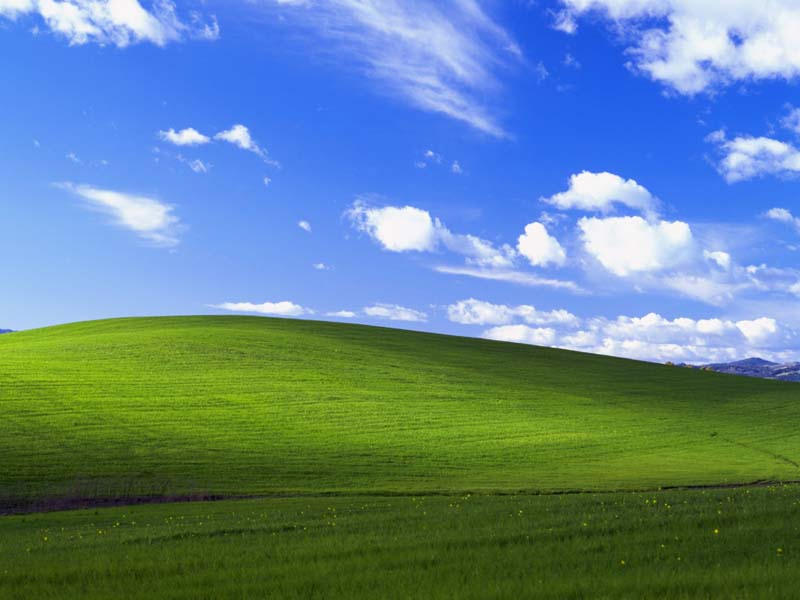
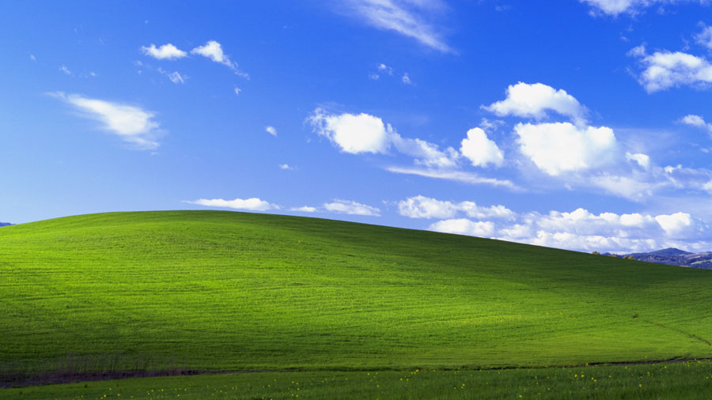
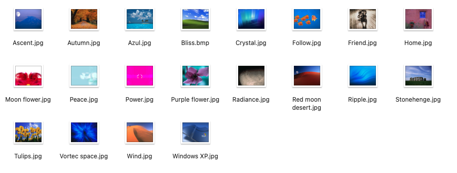
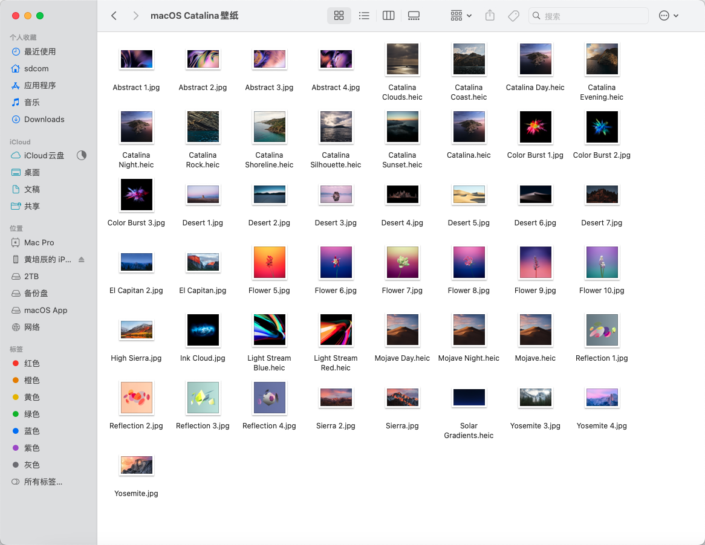

找了一段时间了, 准备做个分享, XP的经典壁纸和Mac OS X Snow Leopard开机音乐, Mac OS X Snow Leopard的开机音乐, 当时听到有MacOS系统时, 第一次被惊艳到, 最近突然怀念XP的壁纸, 为了强迫症下到原版的找了不少, 后来从自己硬盘中找到了之前备份的资源, 顺便也放了4k的上来.

## Windows XP 经典壁纸

Windows XP 原版 [Bli](https://file.ruterfu.com/file/2020/06/09/1591711007794_Bliss.bmp)[ss.bmp](https://cnb.cool/SDCOM_File/img/-/git/raw/master/pictures/2024/04/27/13_16_32_1591711007794_Bliss.bmp.x-ms-bmp)

### 正版 WindowsXP 首次进入OOBE音乐

这个音乐来自 `C:\Windows\system32\oobe\images\title.wma`

下载[title.wma](https://cnb.cool/SDCOM_File/img/-/git/raw/master/pictures/2024/04/27/13_17_20_title.wma)

### 附: Bliss 宽屏版, 下载自 [Mascaloona - Bliss](https://www.deviantart.com/mascaloona/art/Bliss-Windows-XP-15th-Anniversary-Edition-642102213)

#### 4:3

[640x480](https://cnb.cool/SDCOM_File/img/-/git/raw/master/pictures/2024/04/27/13_22_49_1591711391687_Mascaloona%2520-%2520Bliss%2520\(4-3\)%2520\(640%2520x%2520480\).jpg.jpeg) [800x600](https://cnb.cool/SDCOM_File/img/-/git/raw/master/pictures/2024/04/27/13_23_28_1591711721117_Mascaloona%2520-%2520Bliss%2520\(4-3\)%2520\(800%2520x%2520600\).jpg.jpeg) [1024x768](https://cnb.cool/SDCOM_File/img/-/git/raw/master/pictures/2024/04/27/13_23_47_1591711734001_Mascaloona%2520-%2520Bliss%2520\(4-3\)%2520\(1024%2520x%2520768\).jpg.jpeg) [1280x960](https://cnb.cool/SDCOM_File/img/-/git/raw/master/pictures/2024/04/27/13_24_10_1591711850086_Mascaloona%2520-%2520Bliss%2520\(4-3\)%2520\(1280%2520x%2520960\).jpg.jpeg) [1600x1200](https://cnb.cool/SDCOM_File/img/-/git/raw/master/pictures/2024/04/27/13_24_28_1591711869027_Mascaloona%2520-%2520Bliss%2520\(4-3\)%2520\(1600%2520x%25201200\).jpg.jpeg) [1280x1024](https://cnb.cool/SDCOM_File/img/-/git/raw/master/pictures/2024/04/27/13_24_48_1591711787055_Mascaloona%2520-%2520Bliss%2520\(5-4\)%2520\(1280%2520x%25201024\).jpg.jpeg)

#### 16:9

[1280x720](https://cnb.cool/SDCOM_File/img/-/git/raw/master/pictures/2024/04/27/13_26_41_1591711947332_Mascaloona%2520-%2520Bliss%2520\(16-9\)%2520\(1280%2520x%2520720\).jpg.jpeg) [1366x768](https://cnb.cool/SDCOM_File/img/-/git/raw/master/pictures/2024/04/27/13_26_55_1591711963655_Mascaloona%2520-%2520Bliss%2520\(16-9\)%2520\(1366%2520x%2520768\).jpg.jpeg) [1600x900](https://cnb.cool/SDCOM_File/img/-/git/raw/master/pictures/2024/04/27/13_27_14_1591711976584_Mascaloona%2520-%2520Bliss%2520\(16-9\)%2520\(1600%2520x%2520900\).jpg.jpeg) [1920x1080](https://cnb.cool/SDCOM_File/img/-/git/raw/master/pictures/2024/04/27/13_27_39_1591711990076_Mascaloona%2520-%2520Bliss%2520\(16-9\)%2520\(1920%2520x%25201080\).jpg.jpeg) [2560x1440](https://cnb.cool/SDCOM_File/img/-/git/raw/master/pictures/2024/04/27/13_28_0_1591712004460_Mascaloona%2520-%2520Bliss%2520\(16-9\)%2520\(2560%2520x%25201440\).jpg.jpeg) [3840x2160](https://cnb.cool/SDCOM_File/img/-/git/raw/master/pictures/2024/04/27/13_41_5_1591712018206_Mascaloona%2520-%2520Bliss%2520\(16-9\)%2520\(3840%2520x%25202160\).jpg.jpeg)

#### 9:16

[720x1280](https://cnb.cool/SDCOM_File/img/-/git/raw/master/pictures/2024/04/27/13_41_39_1591711884517_Mascaloona%2520-%2520Bliss%2520\(9-16\)%2520\(720%2520x%25201280\).jpg.jpeg) [1080x1920](https://cnb.cool/SDCOM_File/img/-/git/raw/master/pictures/2024/04/27/13_42_4_1591711900198_Mascaloona%2520-%2520Bliss%2520\(9-16\)%2520\(1080%2520x%25201920\).jpg.jpeg) [1440x2560](https://cnb.cool/SDCOM_File/img/-/git/raw/master/pictures/2024/04/27/13_42_28_1591711914433_Mascaloona%2520-%2520Bliss%2520\(9-16\)%2520\(1440%2520x%25202560\).jpg.jpeg) [2160x3840](https://cnb.cool/SDCOM_File/img/-/git/raw/master/pictures/2024/04/27/13_42_44_1591711929654_Mascaloona%2520-%2520Bliss%2520\(9-16\)%2520\(2160%2520x%25203840\).jpg.jpeg)

#### 16:10

[1680x1050](https://cnb.cool/SDCOM_File/img/-/git/raw/master/pictures/2024/04/27/13_43_8_1591712035368_Mascaloona%2520-%2520Bliss%2520\(16-10\)%2520\(1680%2520x%25201050\).jpg.jpeg) [1920x1200](https://file.ruterfu.com/file/2020/06/09/1591712052537_Mascaloona%20-%20Bliss%20\(16-10\)%20\(1920%20x%201200\).jpg) [2560x1600](https://cnb.cool/SDCOM_File/img/-/git/raw/master/pictures/2024/04/27/13_43_33_1591712068184_Mascaloona%2520-%2520Bliss%2520\(16-10\)%2520\(2560%2520x%25201600\).jpg.jpeg) [2560x1080](https://cnb.cool/SDCOM_File/img/-/git/raw/master/pictures/2024/04/27/13_43_52_1591712085155_Mascaloona%2520-%2520Bliss%2520\(21-9\)%2520\(2560%2520x%25201080\).jpg.jpeg) [3440x1440](https://cnb.cool/SDCOM_File/img/-/git/raw/master/pictures/2024/04/27/13_44_4_1591712097718_Mascaloona%2520-%2520Bliss%2520\(21-9\)%2520\(3440%2520x%25201440\).jpg.jpeg)

### 附: WindowsXP 桌面原图(800x600的)  
​

[CNB](https://cnb.cool/SDCOM_File/252.html/-/tree/main/WindowsXP%E5%A3%81%E7%BA%B8) [蓝奏云](https://alist.sdcom.cnstlapy.cn/lanzou/WindowsXP%E5%A3%81%E7%BA%B8/WindowsXP%E5%A3%81%E7%BA%B8.zip) [OneDrive](https://alist.sdcom.cnstlapy.cn/OneDrive-E5/WindowsXP%E5%A3%81%E7%BA%B8) [百度网盘](https://pan.baidu.com/s/10ff-iM8Y09YZLQ4U62CEZg?pwd=1234)

## Mac OS X Snow Leopard(10.6)系统开机音乐

这是由2部分组成的, 视频轨和音频轨, 然后合成得到的音频

第一部分 下载 [intro-sound.mp3](https://cnb.cool/SDCOM_File/img/-/git/raw/master/pictures/2024/04/27/14_1_17_1591712441629_intro-sound.mp3), 第二部分 下载 [macintro.mov](https://cnb.cool/SDCOM_File/img/-/git/raw/master/pictures/2024/04/27/14_1_52_1591712483452_macintro.mov)

## macOS Catalina(10.15) Desktop Picture

[CNB](https://cnb.cool/SDCOM_File/252.html/-/tree/main/macOS%20Catalina%E5%A3%81%E7%BA%B8) [Onedrive](https://alist.sdcom.cnstlapy.cn/OneDrive-E5/macOS%20Catalina%E5%A3%81%E7%BA%B8)
