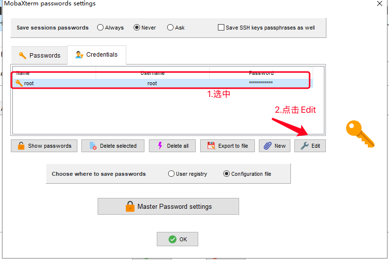

## 前言

昨天(7月20日)实在因为tplink路由器太卡了，加上我家移动光猫的超低配置，让本来就足够卡的网络卡的实在受不了，所以给光猫改了桥接，买了个小米AX3000T，刷了openwrt，来优化下网络

## 配置

这个路由器的CPU采用的是联发科 FiLogic 820系列的MT7981，12nm 双核A53架构，12nm工艺制程，1.3GHz主频（有那么一点点的烫）


内存呢，是256MB(RAM)+128MB(ROM)的组合

网络：4个自适应千兆口（装openwrt后没用过），天线数量4根（5G频段2+1配置）支持160MHz超大频宽，支持近磁场NFC连接wifi（我放书架上面，手机也够不着啊），Wi-Fi 6在我们家也足够了

优点：我买的时候价格155性价比很高，内网轻松跑满千兆（我只办了300mbps宽带），白色外观设计小巧精致，很简洁，我爱看

缺点：网上部分人反应断流严重，但是我刚买了到货，没有那么明显

## 思路

1. 先降级固件到1.0.47 （网上的大部分教程缺了这个步骤，如果是1.0.47可以跳过此步骤）

3. 开启SSH

5. 刷入Uboot

7. 升级固件

## 文件下载

[CNB](https://cnb.cool/SDCOM_File/img/-/git/raw/master/pictures/2024/07/21/%E5%B0%8F%E7%B1%B3ax3000t%E5%88%B7%E6%9C%BA%E7%9B%B8%E5%85%B3%E5%B7%A5%E5%85%B7.zip) [123网盘](https://www.123pan.com/s/bCwtVv-gsSeh.html)

## 安装

### 降级固件（如果是1.0.47跳过此步骤）


**刷机前的准备工作，下载好开头的文件**

(巨坑三次提醒

Win系统一定要关闭自带防火墙等杀毒软件

Win系统一定要关闭自带防火墙等杀毒软件

Win系统一定要关闭自带防火墙等杀毒软件)

**这时我们可以用电脑的有线网口连接路由器的中间2口任一一个**

**打开官方救砖工具。**

**用卡针顶住路由器reset 恢复按钮，再插上电源。持续按住reset按键8s左右，看到指示灯闪烁**


**并上传一个文件夹中1.0.47固件。上传成功后等待3-5分钟，看路由器的蓝灯闪烁。就可以手动断电重启路由，这时路由器就降级为1.0.47系统了**

### 解锁ssh代码

**注意：路由器的IP不一定是192.168.31.1, 可以通过“ping miwifi.com”来确认IP address**


先登录路由器后台，获取到stok，复制红框中高亮的部分，把以下代码的中“你的值”替换即可

在window中win+r 输入cmd


依次输入如下命令：

```
curl -X POST http://192.168.31.1/cgi-bin/luci/;stok=你的值/api/misystem/arn_switch -d "open=1&model=1&level=%0Anvram%20set%20ssh_en%3D1%0A"

curl -X POST http://192.168.31.1/cgi-bin/luci/;stok=你的值/api/misystem/arn_switch -d "open=1&model=1&level=%0Anvram%20commit%0A"

curl -X POST http://192.168.31.1/cgi-bin/luci/;stok=你的值/api/misystem/arn_switch -d "open=1&model=1&level=%0Ased%20-i%20's%2Fchannel%3D.*%2Fchannel%3D%22debug%22%2Fg'%20%2Fetc%2Finit.d%2Fdropbear%0A"

curl -X POST http://192.168.31.1/cgi-bin/luci/;stok=你的值/api/misystem/arn_switch -d "open=1&model=1&level=%0A%2Fetc%2Finit.d%2Fdropbear%20start%0A"
```

每条命令输入回车后会弹出{code：0} 至此ssh已经解锁成功！


**如果出现报错：cURL不是内部或外部命令，也不是可运行的程序，请自行Bing或者Google解决**

### SSH连接路由

#### SN计算获得ssh密码

先得通过SN计算才能得出，SN在下图中，画框中的全部复制


通过这个[Xiaomi Router Developer Guide & Tools](https://miwifi.dev/ssh) 网址输入sn就能得出

或者通过我在前面提供中的 SN计算SSH密码工具

把MobaXterm\_Portable\_v22.1.zip压缩包解压后，连接路由器ssh


选择OK，然后再OK


OK后就会出现弹框，点击ACCEPT

就能看到熟悉的ARE U OK界面了

#### 备份

必须先备份，要不然还原原厂时候麻烦，如果砖了还能救。

输入 `cat /proc/mtd` 回车


备份所有分区

```
dd if=/dev/mtd1 of=/tmp/BL2.bin

dd if=/dev/mtd2 of=/tmp/Nvram.bin

dd if=/dev/mtd3 of=/tmp/Bdate.bin

dd if=/dev/mtd4 of=/tmp/Factory.bin

dd if=/dev/mtd5 of=/tmp/FIP.bin

dd if=/dev/mtd6 of=/tmp/crash.bin

dd if=/dev/mtd7 of=/tmp/crash_log.bin

dd if=/dev/mtd8 of=/tmp/ubi.bin

dd if=/dev/mtd9 of=/tmp/ubi1.bin

dd if=/dev/mtd10 of=/tmp/overlay.bin

dd if=/dev/mtd11 of=/tmp/date.bin

dd if=/dev/mtd12 of=/tmp/KF.bin
```

复制粘贴回车命令看到这个in out就代表备份成功了


我们去tmp目录把他复制出来 就可以删除了


以此类推可以全部备份出来

命令一条条来，备份一个删一个，有几个备份文件比较大，会比较卡耐心等两三分钟。

### Uboot刷入命令

双击左侧的绿色文件夹

继续双击打开tmp文件夹

把准备好的uboot文件拖入到tmp目录

登录成功后先把uboot文件上传到tmp文件夹中然后执行如下命令（#后内容不用复制）

```
cd /tmp #回车进入tmp目录

ls #回车查看uboot是否上传

mtd write mt7981_ax3000t-fip-fixed-parts-multi-layout.bin FIP #回车输入uboot
```

等待3-5分钟 然后uboot写入成功后，指示灯会有变化，然后拔掉电源。

### 刷入openwrt

进入uboot的方法按住路由器的reset键再通电。一直按住状态等待15秒左右

在浏览器里输入192.168.1.1，就能见到uboot的ui界面了（如果未能够进入，请手动设置电脑IP为192.168.1.114）


以后我们就可以直接在uboot界面里选择qwrt，上传网盘中的`openwrt-mediatek-R23.11.11-mt7981-xiaomi_mi-router-ax3000t-squashfs-sysupgrade.bin`固件就可以了。大概三到五分钟就能刷入成功，重启路由就搞定了，重启后电脑设置自动获取IP，固件后台地址192.168.1.1；登录名`root` 密码 `password`


## 插件的管理

这个固件内置了一些插件（原本有openClash和ShadowSocksR Plus+，但是因为兼容问题换成了passwall），是足够日常使用的，如果觉得不够的话可以手动安装


### 安装

用之前刷openwrt的ssh连接工具，连接到路由器





点击OK，在点一次OK，连接ssh


将想要的插件拖进左边的文件管理中

输入`opkg install 插件名.ipk`


只要没有任何的报错，那么就是安装成功了

### 卸载

在openwrt的后台，选择系统>软件包


找到你想卸载的插件，点击旁边的移除，就能卸载了


如果没有报错，那么就是卸载成功了

## 结尾

至此，你就在你的小米AX3000T路由器刷上了openwrt，你就可以体验到更多网上冲浪的许多乐趣了

（一定要在官方店买，大概率会在省内发货，加上顺丰，发货很快的！）

**最后温馨提示：操作有风险，玩机需谨慎，教程仅供参考，操作具体情况请以个人设备为准！**
