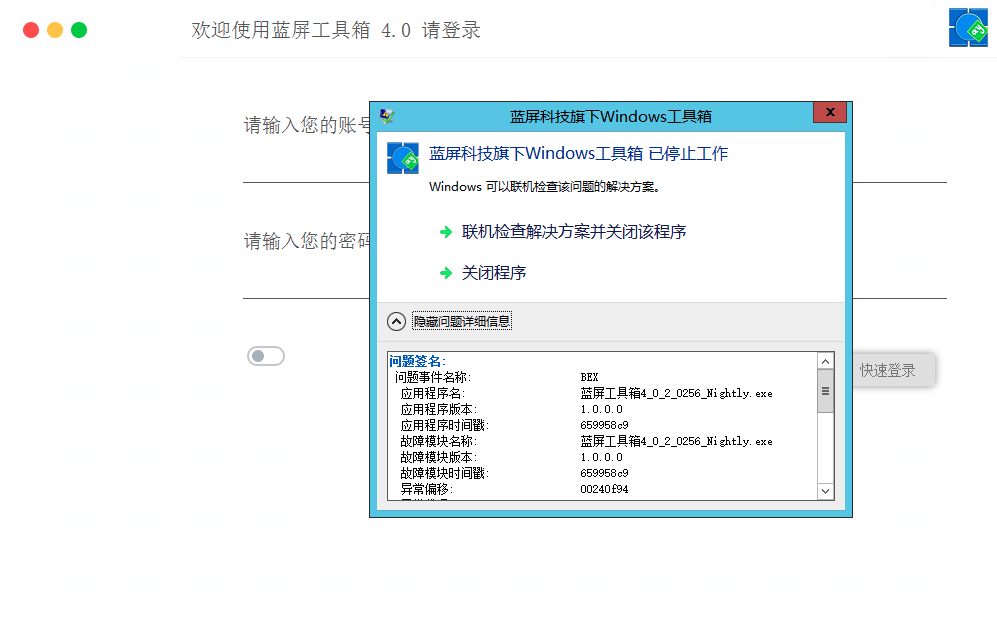
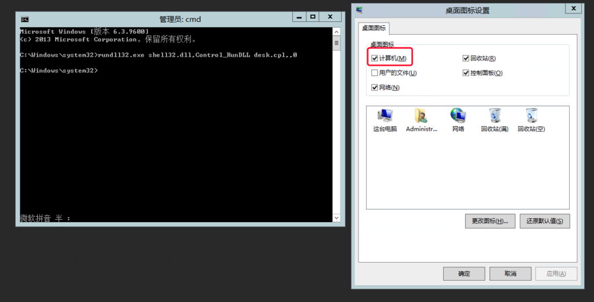
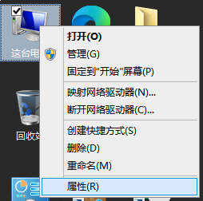
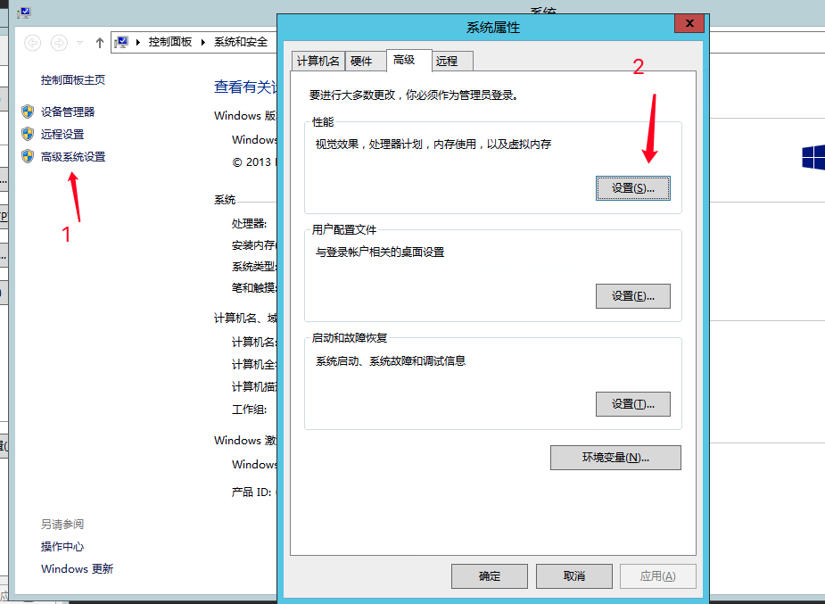
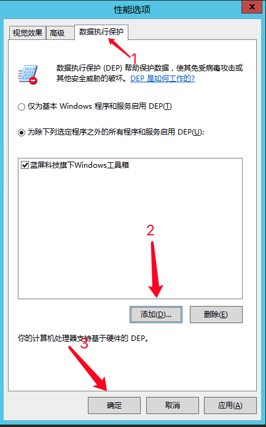

## 前言

很神奇的问题，在Windows普通用户系统是不会出问题，但是在服务器系统就会出问题，经过查证，找到合适的解决方法，本文作记录

## 介绍

据测试，此方法可解决易语言编写的软件在 Windows server 2008-2019 窗口调用DLL时出问题，无法运行，如下图



## 解决步骤

1.如果桌面没有计算机图标，先把图标调出来

打开cmd，输入这一串命令打开勾选桌面显示我的电脑

```
rundll32.exe shell32.dll,Control_RunDLL desk.cpl,,0
```



2.计算机右击属性



3.高级系统设置-高级-性能下的设置



4.数据执行保护-添加-选择易语言编写的软件-确定



5.这是3.的窗口，点确定最终保存所有配置


## 修改完成后

非常完美的效果，完美运行不会报错，各大软件不一，大家请自测


## 结尾

修改系统级选项有风险，请谨慎使用！

希望本文提供的解决方案对您解决易语言软件无法打开的问题起到了帮助作用。在面对技术挑战时，耐心和细心是解决问题的关键。如有更多疑问，请随时寻求专业支持，愿您的计算机使用体验更加顺畅！
