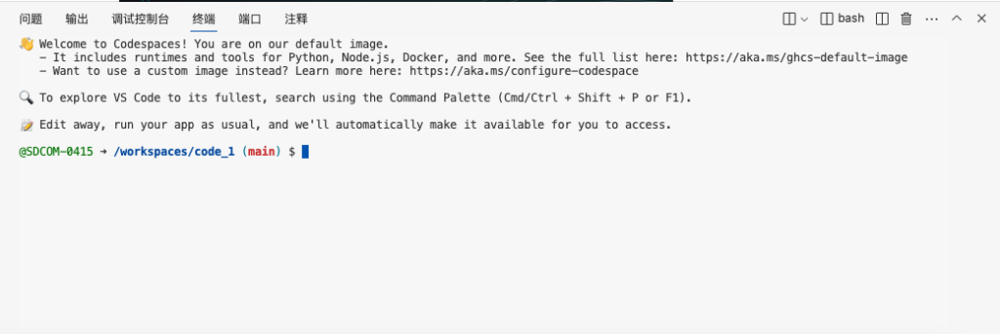
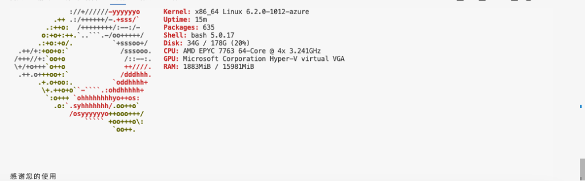

## 前言

本项目在GitHub持续开发，推荐大家去[GitHub](https://github.com/SDCOM-0415/linux_system_info) [gitee](https://gitee.com/SDCOM/linux_system_info/)看看

最近闲的没事在折腾GitHub的codespaces,然后就闲的没事写了一堆的代码,就很奇怪的学习了python和shell.

最开始是调用的python+shell,但是发现这样实在是特别的麻烦,所以,我学习了一点点的小芝士

## 使用

随便找个Linux的系统,打开终端

这里我用的是GitHub的codespaces，大家可以根据需求来测试自己的vps配置

在终端中输入这串命令

国内vps：

`curl -sSL https://gitee.com/SDCOM/linux_system_info/releases/download/0.5/linux.sh | bash`

国外vps：

`curl -sSL https://github.com/SDCOM-0415/linux_system_info/releases/download/0.5/linux.sh | bash`

有这样的页面就代表运行成功了,有什么bug,可以联系sdcom@sdcom.asia

## 结尾

这个文章是我的blog炸的时候写的，放在别人的blog了

艹
