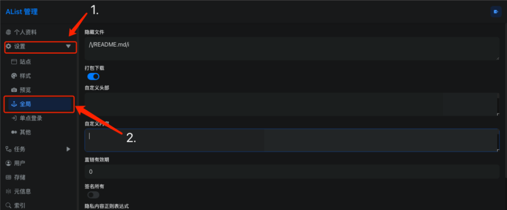

## 前言

某天，我闲来无事逛逛纸飞机，然后，就发现了一个视频，来美化我们的alist

所以我就想着把我的美化了。先看[最终效果](https://dz.sdcom.asia/)


## 准备工作

首先，你需要备份你的alist，以防被搞坏了难以修复


**_声明：小白不推荐这样做，且一定要备份配置文件！！！后果自负！！！_**

## 正式安装

### 进入设置页面

首先，进入全局设置



### 粘贴代码

将演示代码粘贴进入自定义头部和自定义内容

注：若不想从网站复制，点击[此处](https://dz.sdcom.asia/lanzou/%E7%BE%8E%E5%8C%96%E6%95%99%E7%A8%8B%E4%BB%A3%E7%A0%81.zip)下载

**自定义头部**

```
<!--Alist V3建议添加的，已经默认添加了，如果你的没有建议加上-->
<script src="https://polyfill.io/v3/polyfill.min.js?features=String.prototype.replaceAll"></script>

<!--引入字体，全局字体使用-->
<link rel="stylesheet" href="https://npm.elemecdn.com/lxgw-wenkai-webfont@1.1.0/lxgwwenkai-regular.css" />

<!-- Font6，自定义底部使用和看板娘使用的图标和字体文件-->
<link type='text/css' rel="stylesheet" href="https://npm.elemecdn.com/font6pro@6.0.1/css/fontawesome.min.css" media='all'>
<link href="https://npm.elemecdn.com/font6pro@6.0.1/css/all.min.css" rel="stylesheet">

<!--音乐播放器所用的文件-->
<!-- require APlayer -->
<link rel="stylesheet" href="https://npm.elemecdn.com/aplayer@1.10.1/dist/APlayer.min.css">
<script src="https://npm.elemecdn.com/aplayer@1.10.1/dist/APlayer.min.js"></script>
<!-- require MetingJS -->
<script src="https://npm.elemecdn.com/meting@2.0.1/dist/Meting.min.js"></script>

<style>
/* 去除通知栏 右上角 X */
.notify-render .hope-close-button{
	display: none;
}
        /* 
            樱花：https://www.dmoe.cc
            夏沫：https://cdn.seovx.com
            搏天：https://api.btstu.cn/doc/sjbz.php
            姬长信：https://github.com/insoxin/API
            小歪：https://api.ixiaowai.cn/
            保罗：https://api.paugram.com
            墨天逸：https://api.mtyqx.cn
            岁月小筑：https://img.xjh.me
            东方Project：https://img.paulzzh.com
        */
/*白天背景图*/
.hope-ui-light{
  background-image: url("http://pic.rmb.bdstatic.com/bjh/7569b014a1abafd5481298763300ae1d.png") !important;
  background-repeat:no-repeat;background-size:cover;background-attachment:fixed;background-position-x:center;
}
/*夜间背景图*/
.hope-ui-dark {
    background-image: url(http://pic.rmb.bdstatic.com/bjh/ebe942a9de49856f389c65f25a338335.png) !important;
    background-repeat:no-repeat;background-size:cover;background-attachment:fixed;background-position-x:center;
}
/*主列表夜间模式透明，50%这数值是控制透明度大小的*/
.obj-box.hope-stack.hope-c-dhzjXW.hope-c-PJLV.hope-c-PJLV-iigjoxS-css{
background-color:rgb(0 0 0 / 50%) !important;
}
/*readme夜间模式透明，50%这数值是控制透明度大小的*/
.hope-c-PJLV.hope-c-PJLV-iiuDLME-css{
background-color:rgb(0 0 0 / 50%) !important;
}
/*主列表透明*/
.obj-box.hope-stack.hope-c-dhzjXW.hope-c-PJLV.hope-c-PJLV-igScBhH-css {
background-color: rgba(255, 255, 255, 0.5) !important;
}
/*readme透明*/
.hope-c-PJLV.hope-c-PJLV-ikSuVsl-css{
background-color: rgba(255, 255, 255, 0.5) !important;
}
/*顶部右上角切换按钮透明*/
.hope-c-ivMHWx-hZistB-cv.hope-icon-button{
background-color: rgba(255, 255, 255, 0.3) !important;
}
/*右下角侧边栏按钮透明*/
.hope-c-PJLV-ijgzmFG-css{
background-color: rgba(255, 255, 255, 0.5) !important;
}

/*白天模式代码块透明*/
.hope-ui-light pre{
    background-color: rgba(255, 255, 255, 0.1) !important;
}
/*夜间模式代码块透明*/
.hope-ui-dark pre {
    background-color: rgba(255, 255, 255, 0) !important;
}

/*底部CSS，.APP .tanle这三个一起的*/
dibu {
    border-top: 0px;
    position: absolute;
    bottom: 0;
    width: 100%;
    margin: 0px;
    padding: 0px;
}
.App {
    min-height: 85vh;
}
.table {
    margin: auto;
}
/*去掉底部*/
.footer {
    display: none !important;
}

/*全局字体*/
*{font-family:LXGW WenKai}
*{font-weight:bold}
body {font-family: LXGW WenKai;}

/*渐变背景CSS*/
#canvas-basic {
	position: fixed;
	display: block;
	width: 100%;
	height: 100%;
	top: 0;
	right: 0;
	bottom: 0;
	left: 0;
	z-index: -999;
}

</style>

<!--看板娘 -自定义大小，隐藏对话框和对话框高度-->
<style type="text/css">
    #waifu #live2d {
        height: 350px!important;
        width: 350px!important;
    }
    #waifu-tips {
        top: -60px;
        /*display:none !important;隐藏对话框*/
    }
</style>
<!--看板娘加载指定模型-->
<script>
    localStorage.setItem('modelId', '7');
    localStorage.setItem('modelTexturesId', '3');
</script>

<!--自己选左右-->
<script src="https://api.itggg.cn/live2dnew/left/index.js"></script>
<script src="https://api.itggg.cn/live2dnew/right/index.js"></script>
 
<!--以下四个两个主用两个备用的,选一条使用即可-->
<!--自己选左右-->
<script src="https://api.itggg.cn/live2dnew/left/index.js"></script>
<script src="https://api.itggg.cn/live2dnew/right/index.js"></script>

<!--备用的，自己选左右-->
<script src="https://luluossfile.lulufind.com/work/teacher_u20221017ce7b5991_1666420843832_19934968_file.js"></script>
<script src="https://luluossfile.lulufind.com/work/teacher_u20221017bb6d7454_1666420849979_19584065_file.js"></script>

```


**自定义内容**

```
<!--延迟加载-->
<!--如果要写自定义内容建议都加到这个延迟加载的范围内-->
<div id="customize" style="display: none;">
    <div>
		<!--音乐播放器-->
        <meting-js fixed="true" autoplay="false" theme="#409EFF" list-folded="true" auto="QQ音乐或者网易云的链接"></meting-js>

        <br />
        <center class="dibu">
            <div style=" line-height: 20px;font-size: 9pt;font-weight: bold;">
                <span>
                    "
                    <span style="color: rgb(13, 109, 252); font-weight: bold;" id="hitokoto">
                        <a href="#" id="hitokoto_text">
                            "人生最大的遗憾,就是在最无能为力的时候遇到一个想要保护一生的人."
                        </a>
                    </span> "
                </span>
                <p style="margin-left: 10rem;font-size: 8pt;">
                    <small>
                        —— Anwen's Cloud
                    </small>
                </p>
            </div>

            <div style="font-size: 13px; font-weight: bold;">
                <span class="nav-item">
                    <a class="nav-link" href="xxxxxxxxxx"
                        target="_blank">
                        <i class="fab fa-qq" style="color:#409EFF" aria-hidden="true">
                        </i>
                        QQ |
                    </a>
                </span>
                <span class="nav-item">
                    <a class="nav-link" href="mailto:xxxxx@foxmail.com" target="_blank">
                        <i class="fa-duotone fa-envelope-open" style="color:#409EFF" aria-hidden="true">
                        </i>
                        邮箱 |
                    </a>
                </span>
                <span class="nav-item">
                    <a class="nav-link" href="xxxxxx" target="_blank">
                        <i class="fas fa-edit" style="color:#409EFF" aria-hidden="true">
                        </i>
                        博客 |
                    </a>
                </span>
                <span class="nav-item">
                    <a class="nav-link" href="xxxxxxxx" target="_blank">
                        <i class="fas fa-comment-lines" style="color:#409EFF;" aria-hidden="true">
                        </i>
                        留言 |
                    </a>
                </span>
                <span class="nav-item">
                    <a class="nav-link" href="xxxxxxx" target="_blank">
                        <i class="fa fa-cloud-download" style="color:#409EFF;" aria-hidden="true">
                        </i>
                        云盘 |
                    </a>
                </span>
                <!--后台入口-->
                <span class="nav-item">
                    <a class="nav-link" href="/@manage" target="_blank">
                        <i class="fa-solid fa-folder-gear" style="color:#409EFF;" aria-hidden="true">
                        </i>
                        管理 |
                    </a>
                </span>
                <!--版权，请尊重作者-->
                <span class="nav-item">
                    <a class="nav-link" href="https://github.com/Xhofe/alist" target="_blank">
                        <i class="fa-solid fa-copyright" style="color:#409EFF;" aria-hidden="true">
                        </i>
                        Alist
                    </a>
                </span>
                <br />
				<!--添加备案信息-->
                <span class="nav-item">
                    <a class="nav-link" href="https://beian.miit.gov.cn/#/Integrated/index" target="_blank">
                        <i class="fa-solid fa-shield-check" style="color:#409EFF;" aria-hidden="true">
                        </i>
                        冀 ICP备2222000777号
                    </a>
                </span>
            </div>
        </center>
        <br />
        <br />
    </div>

    <!--一言API-->
    <script src="https://v1.hitokoto.cn/?encode=js&select=%23hitokoto" defer></script>
<!--延迟加载范围到这里结束-->
</div>
<!--延迟加载配套使用JS-->
<script>
    let interval = setInterval(() => {
        if (document.querySelector(".footer")) {
            document.querySelector("#customize").style.display = "";
            clearInterval(interval);
        }
    }, 200);
</script>

<!-- 渐变背景初始化,如果要使用渐变背景把下面的那一行注释去掉即可-->
<!-- 下面的几行都是渐变的一套,自定义头部内还有一个关联的自定义CSS -->
<!--<canvas id="canvas-basic"></canvas> -->
<script src="https://npm.elemecdn.com/granim@2.0.0/dist/granim.min.js"></script>
<script>
var granimInstance = new Granim({
    element: '#canvas-basic',
    direction: 'left-right',
    isPausedWhenNotInView: true,
    states : {
        "default-state": {
            gradients: [
                ['#a18cd1', '#fbc2eb'],
                 ['#fff1eb', '#ace0f9'],
                 ['#d4fc79', '#96e6a1'],
                 ['#a1c4fd', '#c2e9fb'],
                 ['#a8edea', '#fed6e3'],
                 ['#9890e3', '#b1f4cf'],
                 ['#a1c4fd', '#c2e9fb'],
                 ['#fff1eb', '#ace0f9']
           
            ]
        }
    }
});
</script>

<!-- 网页鼠标点击特效 - 核心价值观关键字 -->
<script>
    (function () {
        var a_idx = 0;
        window.onclick = function (event) {
            var a = new Array("❤富强❤", "❤民主❤", "❤文明❤", "❤和谐❤", "❤自由❤", "❤平等❤", "❤公正❤", "❤法治❤", "❤爱国❤",
                "❤敬业❤", "❤诚信❤", "❤友善❤");
            var heart = document.createElement("b"); //创建b元素
            heart.onselectstart = new Function('event.returnValue=false'); //防止拖动

            document.body.appendChild(heart).innerHTML = a[a_idx]; //将b元素添加到页面上
            a_idx = (a_idx + 1) % a.length;
            heart.style.cssText = "position: fixed;left:-100%;"; //给p元素设置样式

            var f = 13, // 字体大小
                x = event.clientX - f / 2 - 30, // 横坐标
                y = event.clientY - f, // 纵坐标
                c = randomColor(), // 随机颜色
                a = 1, // 透明度
                s = 0.8; // 放大缩小

            var timer = setInterval(function () { //添加定时器
                if (a <= 0) {
                    document.body.removeChild(heart);
                    clearInterval(timer);
                } else {
                    heart.style.cssText = "font-size:16px;cursor: default;position: fixed;color:" +
                        c + ";left:" + x + "px;top:" + y + "px;opacity:" + a + ";transform:scale(" +
                        s + ");";

                    y--;
                    a -= 0.016;
                    s += 0.002;
                }
            }, 15)
        }
        // 随机颜色
        function randomColor() {
            return "rgb(" + (~~(Math.random() * 255)) + "," + (~~(Math.random() * 255)) + "," + (~~(Math
                .random() * 255)) + ")";
        }
    }());
</script>

<!-- 网页鼠标点击特效 - 爱心 -->
<script type="text/javascript">
         ! function (e, t, a) {
            function r() {
                for (var e = 0; e < s.length; e++) s[e].alpha <= 0 ? (t.body.removeChild(s[e].el), s.splice(e, 1)) : (s[
                        e].y--, s[e].scale += .004, s[e].alpha -= .013, s[e].el.style.cssText = "left:" + s[e].x +
                    "px;top:" + s[e].y + "px;opacity:" + s[e].alpha + ";transform:scale(" + s[e].scale + "," + s[e]
                    .scale + ") rotate(45deg);background:" + s[e].color + ";z-index:99999");
                requestAnimationFrame(r)
            }
            function n() {
                var t = "function" == typeof e.onclick && e.onclick;
                e.onclick = function (e) {
                    t && t(), o(e)
                }
            }
 
            function o(e) {
                var a = t.createElement("div");
                a.className = "heart", s.push({
                    el: a,
                    x: e.clientX - 5,
                    y: e.clientY - 5,
                    scale: 1,
                    alpha: 1,
                    color: c()
                }), t.body.appendChild(a)
            }
 
            function i(e) {
                var a = t.createElement("style");
                a.type = "text/css";
                try {
                    a.appendChild(t.createTextNode(e))
                } catch (t) {
                    a.styleSheet.cssText = e
                }
                t.getElementsByTagName("head")[0].appendChild(a)
            }
 
            function c() {
                return "rgb(" + ~~(255 * Math.random()) + "," + ~~(255 * Math.random()) + "," + ~~(255 * Math
                    .random()) + ")"
            }
            var s = [];
            e.requestAnimationFrame = e.requestAnimationFrame || e.webkitRequestAnimationFrame || e
                .mozRequestAnimationFrame || e.oRequestAnimationFrame || e.msRequestAnimationFrame || function (e) {
                    setTimeout(e, 1e3 / 60)
                }, i(
                    ".heart{width: 10px;height: 10px;position: fixed;background: #f00;transform: rotate(45deg);-webkit-transform: rotate(45deg);-moz-transform: rotate(45deg);}.heart:after,.heart:before{content: '';width: inherit;height: inherit;background: inherit;border-radius: 50%;-webkit-border-radius: 50%;-moz-border-radius: 50%;position: fixed;}.heart:after{top: -5px;}.heart:before{left: -5px;}"
                ), n(), r()
        }(window, document);
    
</script>
```


将这两段代码放入后，就基本美化完成了，可以按照个人的需求来进行优化

## 结尾

小白使用需谨慎，数据无价，数据丢失本人概不负责！
