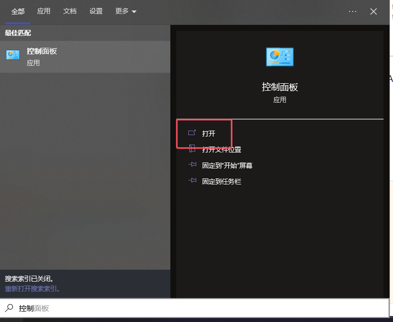
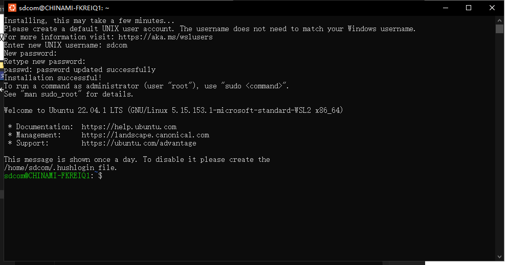

## 前言

闲来无事想着来想搞Linux，奈何家里的Windows服务器在跑着项目，动也不敢动，家里的[openwrt路由器](https://sdcom.cnstlapy.cn/318.html)和随身WiFi配置不太够，储存空间又太小，不太够我玩docker一类的，所以就想着搞一个[WSL](https://www.bing.com/search?q=WSL)来给我玩玩，所以就在[Microsoft store](https://www.bing.com/search?q=Microsoft%20store)下了几个Linux系统，然后就发现全部装在了C盘，让我本来就不够的C盘空间雪上加霜，所以就想着能不能装在我的其他盘里面，所以就有了这篇文章

## 启动虚拟化

### 查看配置

在安装之前，请确保你的电脑支持虚拟化（VT-d、AMD-v），且在系统在Windows10以上，查看是否开启虚拟化可以这样看：打开任务管理器，选择性能一栏，查看CPU一页的虚拟化处是否为已启用


如果没有启用，请在主板的BIOS进行查看是否有和VT-d、AMD-v相关的设置并打开，或者去搜索自己的设备型号寻找来打开自己电脑虚拟化的教程

### 启动必要功能

你可以选择使用以下命令或者手动使用控制面板打开的方式来启动必要功能呢

```
# 使用powershell运行
dism.exe /online /enable-feature /featurename:VirtualMachinePlatform /all /norestart
```

进入控制面板



选择程序


点击启用或关闭Windows功能


然后打开Hyper-V、Windows虚拟机监控程序平台以及适用于Linux的Windows子系统


然后选择立即重新启动


## 手动安装

#### 安装内核更新包

进入powershell或终端，输入`wsl --update`来更新内核


#### 设置默认WSL版本

因为我们只用得到WSL2，所以打开 PowerShell，运行以下命令，将 WSL 2 设置为默认版本：

```
# 设置默认WSL版本为WSL2
wsl --set-default-version 2
```


下载离线安装包

微软提供了一个手动下载WSL发行版的网址：[旧版 WSL 的手动安装步骤 | Microsoft Learn](https://learn.microsoft.com/zh-cn/windows/wsl/install-manual#downloading-distributions)

不过微软的下载很慢，我这边使用了魔法都还是有些慢，所以这边也提供123网盘的部分系统

[123官方链接](https://www.123865.com/s/bCwtVv-3RZeh) [CNB](https://cnb.cool/SDCOM_File/437.html/-/tree/main/WSL) [IPv4下载站](http://alist.sdcom.asia/123pan/1/Apps/Windows/WSL)


选择任一版本下载，以Ubuntu 22.04为例：

将下载下来的文件使用任意一个解压软件解压


解压后文件夹有一个后缀名为.appx的文件，再次解压


将文件夹移动到想要安装的路径中，解压后文件夹得到一个.exe文件，双击运行；

  
需要注意的是：安装目录的磁盘不能开压缩内容以便节省磁盘空间选项，否则会报错

  
可以右键文件夹–>属性–>常规–>高级找到并关闭这个选项回到PowerShell查看所有系统：


双击打开后等待一段时间后安装完成，然后自行设置账户和密码


账户名字母必须为小写，密码输入期间不会显示

出现这个界面就是安装成功了



安装成功后 文件夹下多一个ext4.vhdx镜像，可以理解为安装的位置

这样安装后，linux产生的文件是默认在刚刚自定义选择的路径下。WSL1的安装位置下有个rootfs文件夹就是子系统里的全部文件。**WSL2(本质虚拟机)是放在虚拟磁盘(**.vhdx)

回到PowerShell输入如下命令查看所有系统：

```
wsl -l -v
```


如图所示已安装成功

## 卸载WSL

先打开powershell,输入wsl --list，查看你安装的版本，然后输入wsl --unregister <要卸载的发行版>，之后删掉目录下的那个子系统就可以了

## 参考信息

[旧版 WSL 的手动安装步骤 | Microsoft Learn](https://learn.microsoft.com/zh-cn/windows/wsl/install-manual)

## 结尾

总之，这样你就在Windows上安装了Linux子系统，可以尽情的体验Linux系统的乐趣了！

**最后温馨提示：操作有风险，玩机需谨慎，教程仅供参考，操作具体情况请以个人设备为准！**
