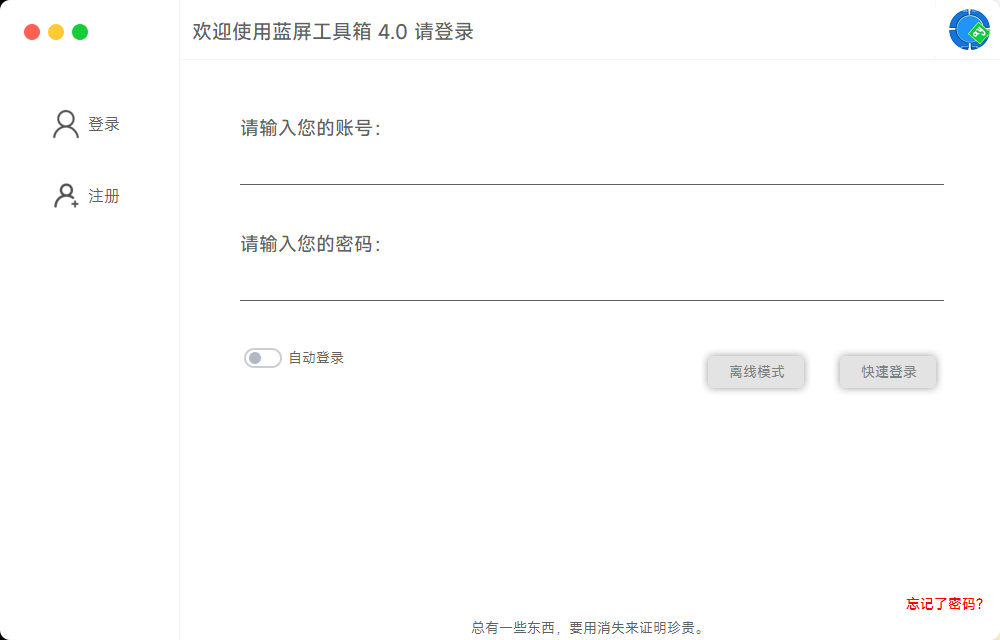
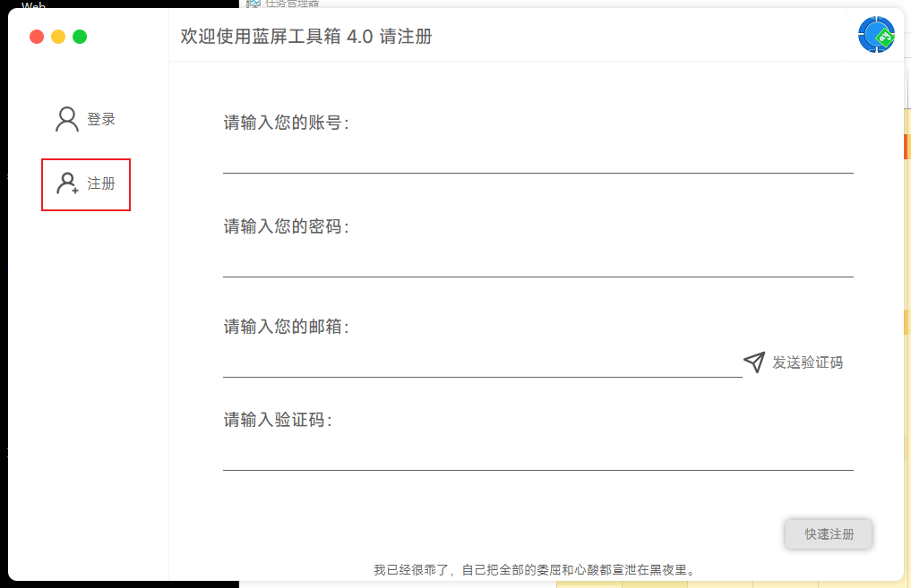
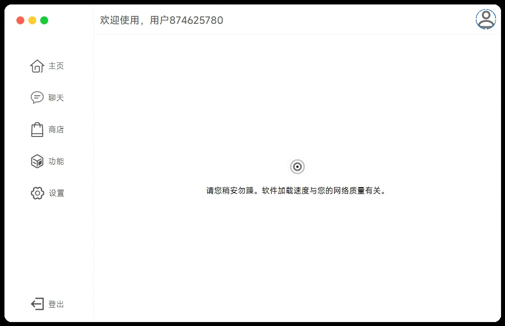
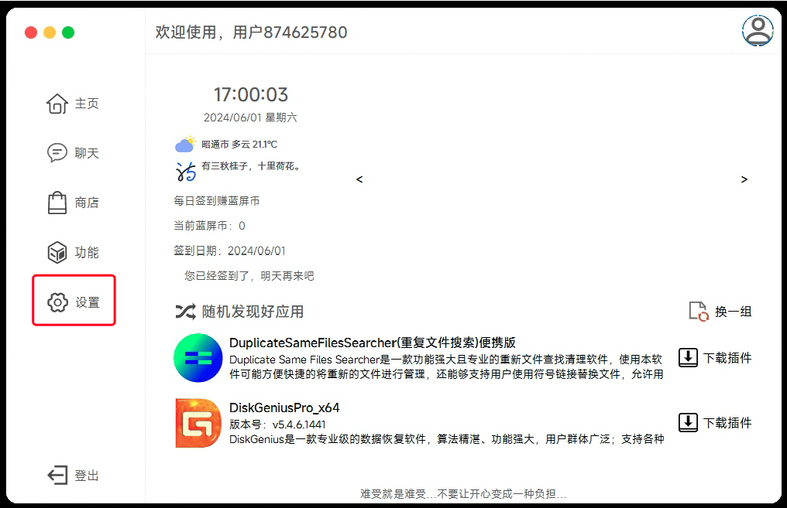
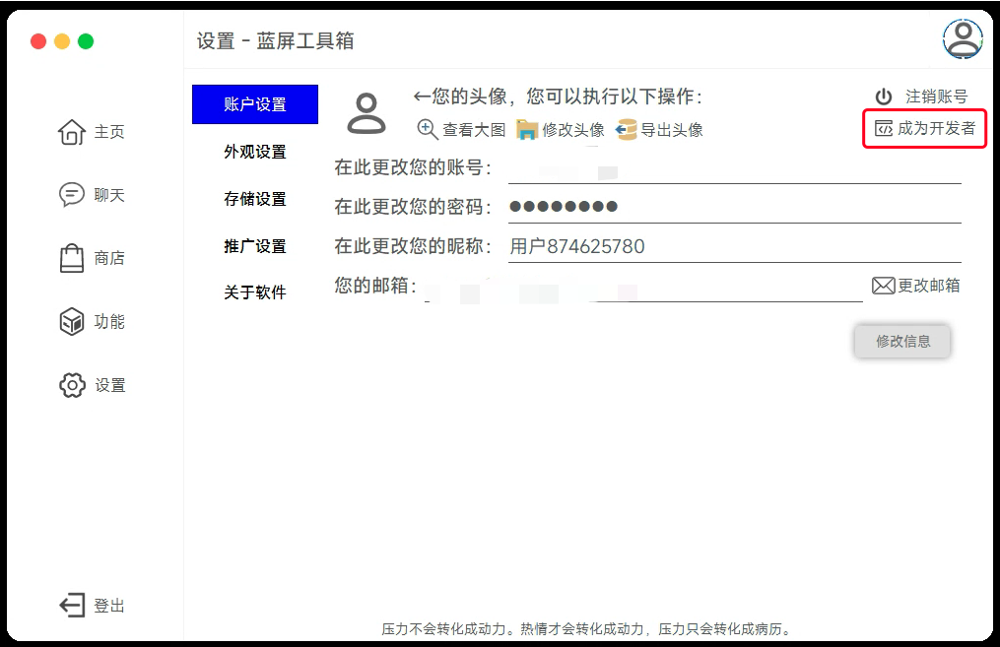
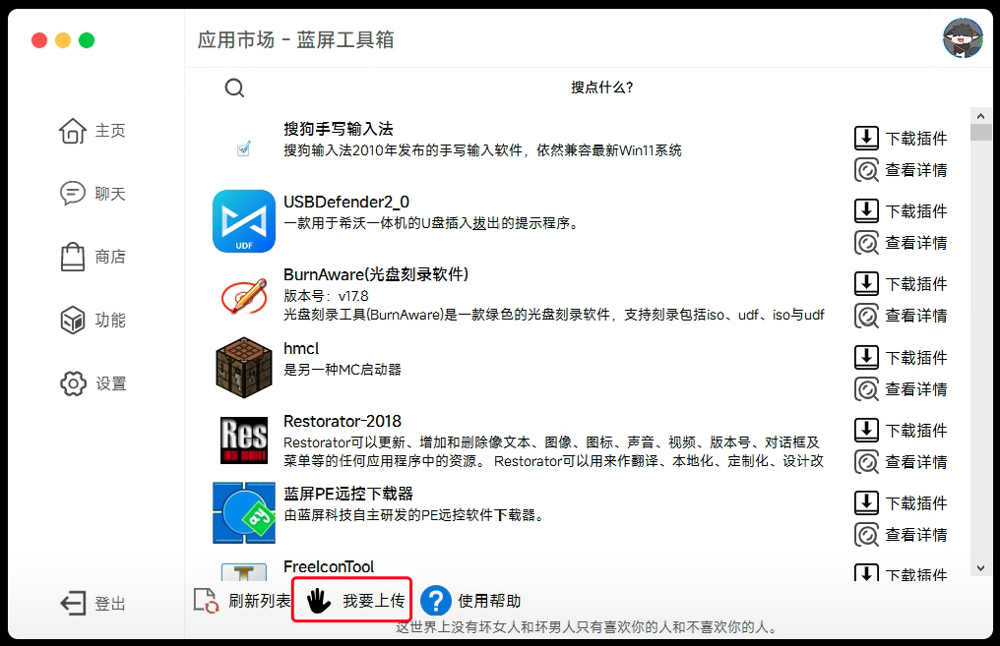
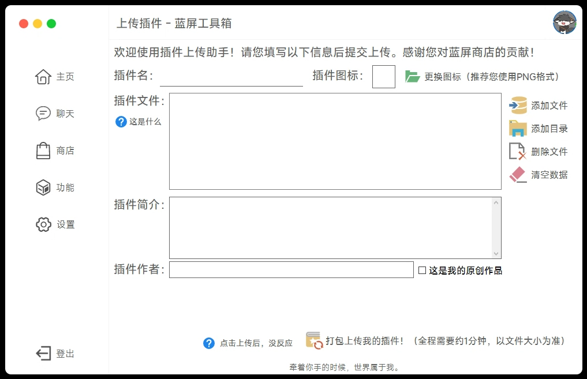
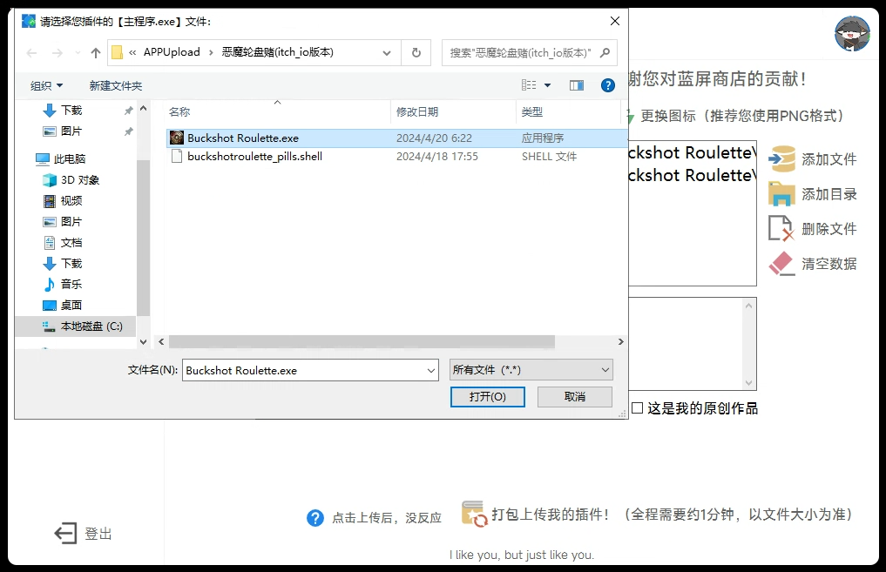

## 前言

公司发布了新版本的[蓝屏工具箱](http://tools.chgskj.cn)，其中也有插件功能，这个功能很好的为开发者提供了一个分享自己的作品的一个平台以及展示自己的机会，那么这一篇文章就是来教大家如何在蓝屏工具箱上传插件

## 文字教程

1.安装并打开蓝屏工具箱

2.注册你的账号

注册完了是这样的，等待进入主页面

3.进入主页后点击设置

4.点击"成为开发者"

5.点击商店进入插件市场

6.选择我要上传

7.填写你要上传的插件信息

8.选择主程序上传并等待审核

## 视频教程

没有看懂文字教程？没有关系，这里还有视频教程

<iframe style="position: absolute; width: 100%; height: 100%; left: 0; top: 0;" src="//player.bilibili.com/player.html?isOutside=true&amp;aid=1005242919&amp;bvid=BV1Cx4y1n71G&amp;cid=1565735057&amp;p=1&amp;as_wide=1&amp;high_quality=1&amp;danmaku=1" frameborder="no" scrolling="no"></iframe>

## 结尾

希望能够通过这篇文章来帮助你在蓝屏工具箱上传插件
