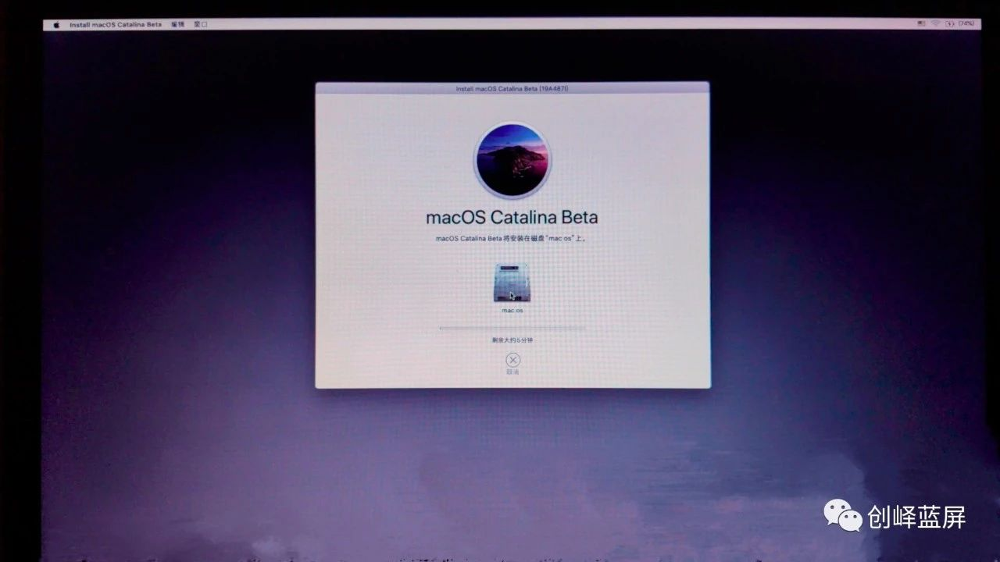
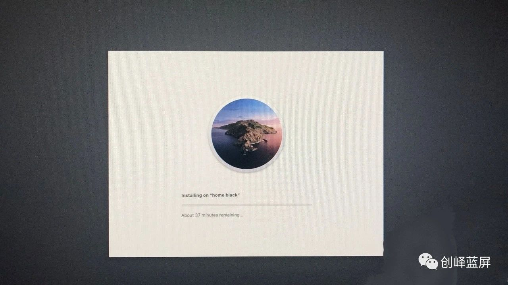

Welcome！

今天我们教大家如何来安装黑苹果

## **准备工作**

- 一个8G以上的U盘（安装 10.15 Catalina 或以上的系统必须要16G及以上的U盘 ）；

- Mac OS镜像、Etcher（刻录工具）、DiskGenius（分区工具）、EFI驱动文件（Big Sur以下推荐使用CLOVER，以上则推荐使用OC）。

- 下载地址：[macOS | SDCOMの下载站](https://alist.sdcom.cnstlapy.cn/OneDrive-E5/%E9%95%9C%E5%83%8F%E5%BA%93/macOS)

## **制作启动U盘**

1. 将您的U盘插入电脑，为保证成功，首先将U盘以默认值格式化一次；

3. 打开balenaEtcher软件，点击“Select image”选择你刚才下载好的安装镜像；

5. 然后点击“Select drive”选择你的U盘，如果你直插有一个U盘，软件会自动选择；

7. 接着点击“Flsh！”开始刻录黑苹果安装镜像到U盘；

9. 刻录完成后会进行一次完整性检测；

11. 等到提示“Flash Complete！”Successful device 就完成安装镜像的制作了，把U盘弹出并拔出。

13. 至此，黑苹果镜像就刻录完成！

## **配置EFI引导驱动**

1. 打开分区工具DiskGenius，找到U盘上的ESP（有的叫EFI）分区，删除自带的EFI文件(可选择不删除，若不删除，跳过步骤2)。

3. 把适合自己电脑EFI文件夹复制进去。这里只能用快捷键粘贴，Ctri+C复制，Ctrl+V粘贴。这里有我收集的一些EFI资源，集合多种电脑配好的EFI驱动文件，除三代处理器以下或更低配置的电脑，部分支持Big Sur，在文件名会标注具体文件名，基本主流配置的电脑都有收集，可直接替换使用。

## **制作Mac系统盘**

制作Mac系统盘分为分区安装与整个磁盘安装两种情况，其实大同小异，但问的人很多，这里就都讲一下。分区安装的意思就是我一块磁盘几个分区中的一个用来装Mac系统，跟Windows系统的C盘D盘一样，数据互不影响。整个磁盘安装就是我一整块磁盘都用来装Mac系统，我个人建议，有条件的还是选整个磁盘安装。

### 分区安装

- 计算机右键>管理>磁盘管理

- 首先检查磁盘是否符合要求，磁盘格式必须为GPT格式(GUID)，即右键这个磁盘，“转换为MRB磁盘”为灰色就是GPT格式。

- 另外磁盘不能有小于200M的分区且必须有EFI分区（EFI分区也必须大于200M），满足这两个基本条件后，右键压缩卷（用分区工具查看）。d.输入压缩大小，根据自己情况及要求输入，最小30G。e.接下来选中被压缩的分区，右键新建简单卷。

- 然后就一路默认下一步，但注意有一项要选择“**不要格式化这个卷**”；

- 一路默认下一步即可；

**注意**：这一步必须要选“不要格式化这个卷”；

- 继续默认下一步直至完成；

### 整个硬盘安装

- 整个磁盘只装mac系统，那就删除磁盘所有分区，变成一个全新的磁盘即可。

- 在系统磁盘管理中会显示未分配：

- 至此安装盘搞定，黑苹果完成了85%。

## **安装Mac系统**

1.设置BIOS，重启按F2用U盘进BIOS（电脑不一样，按键也不一样，就看自己电脑型号）;

2.首先设置硬盘模式为AHCI，否则会出现磁盘工具读不到内置硬盘的情况（即找不到自己做的苹果安装盘）；

3.然后关闭安全启动Secure Boot或者选择其他操作系统（这是微软为了防止安装Windows操作系统的电脑改装linux而设置的，不关闭无法启动到四叶草）；

4.打开UEFI引导模式；

5.第一启动项选择自己刻录好的U盘，UEFI OS+U盘名称；

6.保存重启，进入四叶草引导或OC引导界面；

7.进入引导界面后，选择Boot MacOS install from install macOS Big Sur ，并回车进入；

8.过一会儿会进入启动界面;

9.跑完代码或进度条之后进入安装界面，先选择磁盘工具；

10.选中自己做的Mac系统盘，一般名字颜色比较浅，灰色的那个（看清楚千万不要选错）；

11.然后抹掉磁盘，名字随便输，格式按固态硬盘选APFS格式，机械硬盘选扩展日志式；

**提示：**如果抹盘失败，提示空间不足，就是你的磁盘格式没处理好，重新进win修改格式为GPT；

12.抹掉磁盘之后，关闭“磁盘工具”，选择“安装macOS ”;

13.然后找到自己刚刚抹掉的那个盘，选中后安装！

14.一路同意默认下一步即可；第一次安装界面:

15.第一次安装完后会重启，重启还是选U盘启动，进入四叶草选择 Boot MacOS from X，（X你刚刚抹掉的那个安装盘的名字）过一会儿会进入正式安装界面。

二次安装界面:

16.二次安装完，黑苹果就安装到你的硬盘了，重启后还是选U盘启动，进入引导页面选择 X（你抹掉磁盘的名字），进入苹果系统；

17.设置好账户密码等，就可以进入桌面了；

## **更改硬盘启动**

1. 打开分区工具，把刚刚的EFI文件夹里的clover文件夹拷贝到硬盘的ESP分区（有的显示“EFI”，操作跟之前一样，用快捷键拷贝）；

3. 安装EasyUEFI引导工具(win要GPT引导模式，否则会报错或者无引导项)；

5. 装完之后，打开主界面，管理EFI启动项；

7. 进入管理界面后，点击 “**+**”，新建引导项；

9. 类型选择Linux或其他操作系统；

11. 描述，即新建引导项的名字，自己随便输，我这里输入的“CLOVER”（注意英文输入法输入）；

13. 选择目标分区，选中自己硬盘的ESP分区,即刚才拷贝EFI文件的分区，然后点浏览，进行下一步；

15. 找到EFI/CLOVER/文件夹下的 CLOVERX64.efi 启动文件；（oc引导在EFI/OC/文件夹选择OpenCore.efi）

17. 选中后确定，完成新建引导项；

19. 然后调节新建的引导项为第一启动项；

21. 最终，硬盘引导修改完成，以后可以拔掉U盘启动macOS了；

## 安装驱动(oc驱动安装)

在使用的时候，通常会遇到许多问题，例如笔记本上使用却没有Wi-Fi，台式机连接网线也没有办法使用，所以，在这时候就需要安装适合自己的驱动。

**注意：部分EFI是配置了驱动的，前提是主板完全对应，而系列主板能够通用。**

1. 在文章开头的下载链接中，找到 EFI驱动 这个页面

3. 下载合适自己的驱动

5. 下载完成驱动后，返回到 EFI配置修改工具 页面

7. 下载配置修改工具并打开

9. 将下载好的配置文件中的Config.plist拖入软件

11. 找到软件左侧的 Kernel

13. 将下载好的驱动文件拖入当中（需要解压，为文件夹）

15. 点击上方保存按钮保存

17. 将新的EFI用分区工具DiskGenius添加到EFI，添加操作参考”**配置EFI引导驱动**“

至此黑苹果安装教程写完，祝各位尽早吃上黑苹果！
