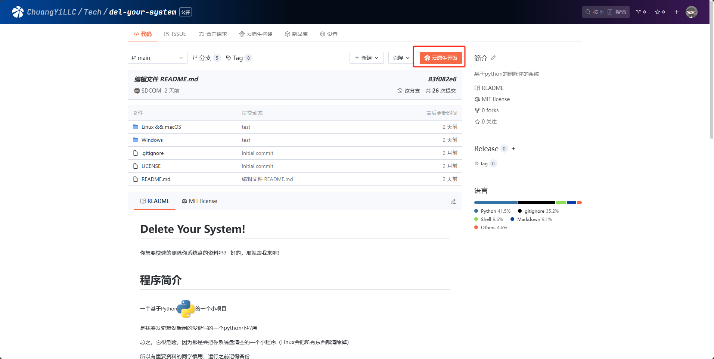
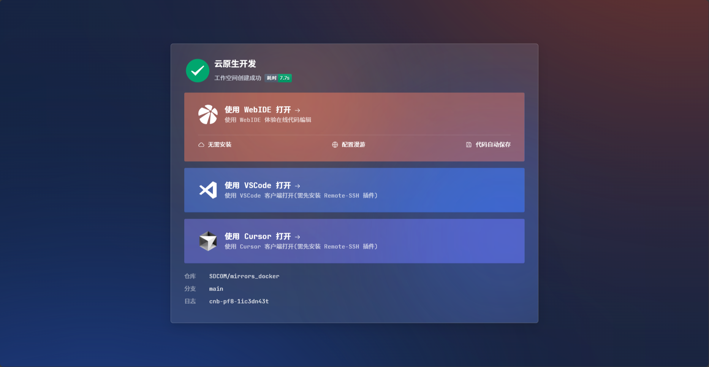
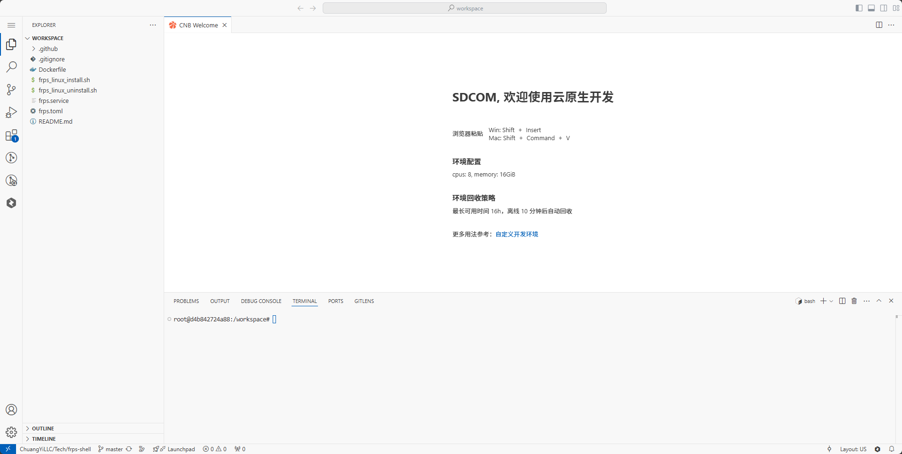
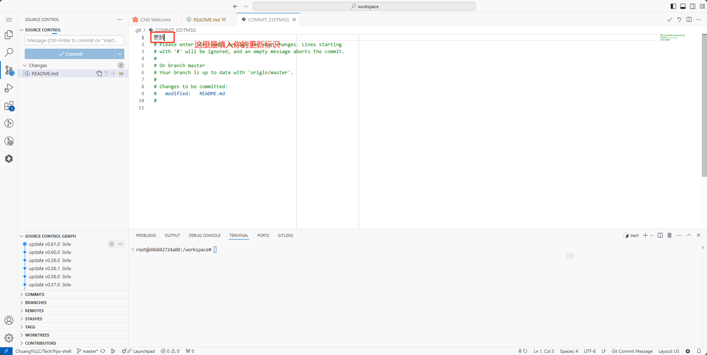
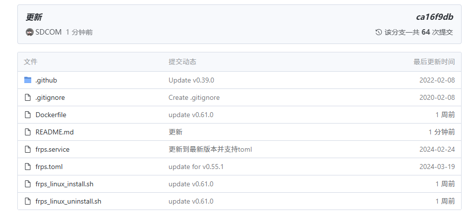
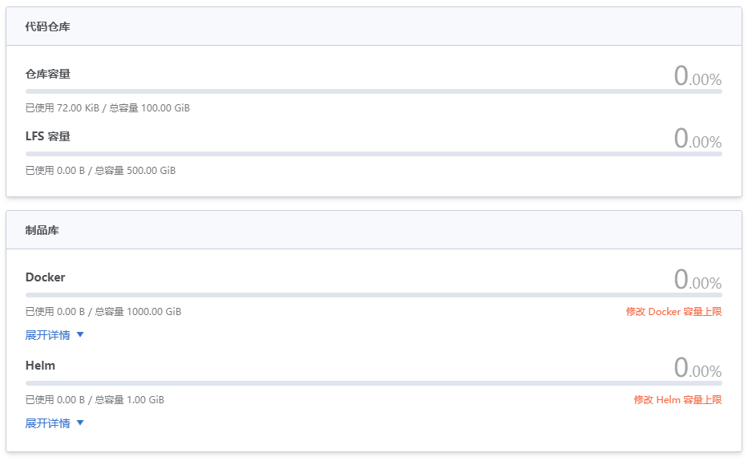

## 前言

最近，我看我们公司里面都在传一个很好用的写代码的东西，和GitHub啊，gitee这些都是差不多的一个东西，叫**云原生构建(CNB)**，网址是cnb.cool（吹牛逼.酷！），然后他们还说是腾讯出的，我就想：腾讯哪来免费的东西啊，以后包付费的，但是，按我们公司现在的说法来看，腾讯的CNB可是要干翻友商的啊！

于是我就抱着“**试试就逝世**”的心态玩了玩，发现这东西好用的根本不像是腾讯出的产品，而且发现**CNB**和普通的gitee还有github一些不一样的地方，以及一些更好的地方

## 使用

首先，我们就要知道**云原生构建**他是个什么东西

这其实就是一种基于 Docker 的开发环境（运行在Docker，用完就可以删掉，不用担心被玩坏掉），与代码同源管理的远程开发解决方案，并且可以使用Web版本的ide或者通过VSCode客户端进行远程连接（其实这个Web版本就是之前我推荐过的[code-server](https://sdcom.cnstlapy.cn/257.html)，相比于原版，它有着更好的网络兼容性，对国内用户有着更好的稳定性，而且官方也在积极的为海外用户做适配，为国内的用户修bug，这也就是我在前面说的这东西好用的根本不像是腾讯出的产品）

在往常开发的时候，你通常需要在本地写好了代码，再使用Git远程推送到GitHub上面，这样是有些过于麻烦了，而我是根本不会使用Git的这种小白，所以一般都是在本地写好了直接复制粘贴到GitHub上面去，也是一样的很麻烦

而在**云原生构建CNB**中，你只需要在仓库的分支选择页面，点击右上角的**云原生开发**按钮，就会开始创建一个默认的开发环境

网页版进去以后是这样子的，和本地VS Code是差不多的

在当你编写完代码后，你不必使用Git指令，可以直接使用可视化Git就可以重新向你的仓库推送你更新后代码了

这样就推送上去了，相比于GitHub的代码空间访问好的多，和没有代码空间的gitee相比，那更是天上地下，这样子就十分的方便

它还支持自定义开发环境。如果想要创建一个自定义的开发环境，可以在仓库中创建配置文件进行定制，具体操作方法可以看[官方文档](https://cnb.cool/examples/showcase)

你以为它仅仅只能云原生构建和云原生开发吗？

不不不，这你就错了，它的每个仓库都有一个独立的docker和helm的制品库

就拿docker来说，你可以把你构建好的镜像直接放在CNB，然后你就直接能用CNB下载你的docker镜像了，而且速度也很快

每个仓库默认是有100GB的代码储存空间，LFS容量有500GB，docker制品库有1000gb，十分的绰绰有余，而且docker的存储容量还可以扩容

除此之外，云原生开发可以自定义开发环境，还可以自定义创建流程、资源规格、创建时机等，让我们的开发更加方便，避免因为环境配置或者拉取代码耗费大量的时间

根据官方给出的数据，**125G**的AOSP项目源码在使用云原生构建，且存在代码缓存的情况下，拉取代码只需要**3.8秒**，构建环境也只需要1分30秒

而我在GitHub的项目，不到5秒就可以迁移完毕，即使是大一点的项目，也用不了多少的时间，比直接一点点下载快的多了

而且作为腾讯出品下载速度也是十分的快，下载项目的时候都很舒服

只可惜现阶段不能以个人的名义来创建仓库，而是必须要有一个组织，而组织要通过官方微信群的连接才能申请

并且，在深入了解之后，发现**CNB**的免费权益比其他家的都好，又是国内的大厂商，这下可以当一个白嫖怪了~

## 尾声

总的来说，**CNB**是一款不错的后起之秀，目前 **CODING 2.0 云原生构建 CNB** 正在公测开放体验中，大家快来体验吧！

访问地址：[https://cnb.cool](https://cnb.cool)

**“云原生构建，启动！”**
